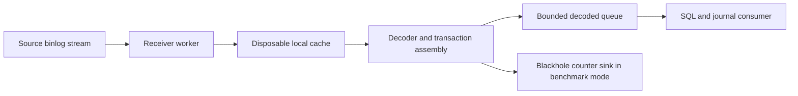

# Native versus custom replication benchmark

For shared scenarios, demos and comparable backlog measurements across both
replication topologies, use the [profile-driven test lab](../docs/TEST_LAB.md).
The commands below retain their original specialized scopes.

`make lab-benchmark PROFILE=mysql84-to-mysql57-myisam ARGS="--mode streaming"` runs [sysbench](https://github.com/akopytov/sysbench) against a
fresh MySQL source while native replication and mysql-replicator consume the
same binlog. It reports source commits, applied transactions, backlog bounds,
and observed catch-up time, then compares exact final rows on all three servers.

This is a repeatable local baseline for investigating costs. No performance
threshold is currently a pass/fail requirement; a pass means the requested load
completed, both replicas caught up, final data matched, and cleanup succeeded.

## Run

Requirements: Swift, Docker Compose with Linux/amd64 support, and OpenSSL.
The load generator and SQLite CLI run in containers. No host sysbench or
mysqlbinlog installation is needed. Run from the repository root:

```sh
# 1,000 single-row INSERT transactions, offered at 100 events/sec, one client.
make lab-benchmark PROFILE=mysql84-to-mysql57-myisam ARGS="--mode streaming"

# Small harness check: concurrent writers and three rows per statement.
make lab-benchmark PROFILE=mysql84-to-mysql57-myisam ARGS='--mode streaming --events 60 --rate 10 --threads 2 --rows-per-event 3 --workload mixed'

# Reuse images built from these exact inputs; offer writes as fast as possible.
make lab-benchmark PROFILE=mysql84-to-mysql57-myisam ARGS='--mode streaming --skip-build --events 5000 --rate 0'

# Rate-controlled run with larger rows.
make lab-benchmark PROFILE=mysql84-to-mysql57-myisam ARGS='--mode streaming --skip-build --events 3000 --rate 100 --payload-bytes 512'
```

Each invocation creates its own stack under `artifacts/performance/`, without
using or replacing the interactive demo session. Normal completion and caught
errors stop the load generator, archive logs and local replication state, and
delete the run's containers and volumes. Abruptly killing the harness may leave
resources behind; its `compose.yaml`, run identifier, and `current.json` identify
the stack. Do not use the interactive demo commands to manage a benchmark stack.

| Option | Default | Meaning |
| --- | --- | --- |
| `--events` | 1000 | Total statements, across all clients; 1–1,000,000 |
| `--threads` | 1 | Source connections; 1–32 |
| `--rate` | 100 | Offered statements/sec across all clients; 0 means unlimited |
| `--workload` | insert | `insert`, or `mixed` INSERT/UPDATE/DELETE cycles |
| `--rows-per-event` | 1 | Rows changed by each statement; 1–100 |
| `--payload-bytes` | 100 | ASCII payload bytes per row; 0–1024 |
| `--sample-seconds` | 5 | Desired polling interval; 1–30 seconds |
| `--timeout` | 300 | Separate load and catch-up deadlines; 10–3600 seconds each |
| `--batch-transactions` | 32 | Maximum source groups per journal batch; 1–256 |
| `--tables` | 1 | Benchmark tables (`bench`, `bench_1`, ...); 1–32 |
| `--table-distribution` | uniform | `uniform`, or `hot80` with at least two tables |
| `--table-run` | 1 | Consecutive INSERT cycles per table selection per client; 1–10,000 |
| `--insert-rows` | 32 | Maximum rows in a target INSERT statement; 1–128; 1 disables fusion |
| `--overlap-preparation` | on | Collect/validate the next batch while target SQL executes |
| `--flush-on-table-change` | off | Enable to compare with the old table-change journal barrier |
| `--explicit-table-locks` | off | Send client LOCK/UNLOCK TABLES commands; internal MyISAM locks always apply |
| `--decoder-profile` | on | Detailed decoder function timings; `on` or `off` |
| `--applier-profile` | on | Detailed applier timings; `on` or `off` (normal benchmark only) |
| `--skip-build` | off | Reuse existing runtime and load-generator images |

Rebuild after code changes. The workload hash is checked even with `--skip-build`;
the replicator image digest and the skip-build choice are recorded. A reused
runtime is not automatically proven to match the current source tree.

## Workload and topology

The benchmark reuses the demo's isolated topology and verified TLS replication:

- MySQL 8.4 InnoDB source.
- Native MySQL 8.4 MyISAM replica, with parallel replication disabled.
- mysql-replicator's static release executable applying to MySQL 5.7 MyISAM.

The sysbench image uses pinned Ubuntu 24.04 and
[sysbench 1.0.20+ds-6build2](https://packages.ubuntu.com/noble/amd64/sysbench).
Its fixture account can only SELECT/INSERT/UPDATE/DELETE in the benchmark database and
must use TLS. It connects only to the disposable source. The harness does not
accept external database credentials or endpoints.

The custom Lua workload uses supported BIGINT and VARCHAR columns, a primary key,
and one autocommit statement per event. It avoids explicit multi-statement
transactions, which are outside the current MyISAM application contract. Every
event changes exactly `rows-per-event` rows. Each client owns disjoint keys.
`mixed` cycles through INSERT, UPDATE, and DELETE as separate events; a finite
run may end partway through a client's cycle. Errors are fatal rather than
silently retried. The event limit, committed GTID count, and applied row count
must agree.

Table routing is deterministic per client. `uniform` rotates through all tables;
`hot80` sends four of each five selections to `bench`, rotating the remaining
selection through the other tables. Finite runs and partially completed cycles
can differ from precisely 80%. All three phases of a mixed cycle use the same
table. `--table-run 16` produces longer runs on each selected table; the default
of 1 exercises frequent table switches. Neither option reorders replication.

For the three basic 10K scenarios, use `--events 10000 --rate 0
--decoder-profile off`, with `--tables 1`, `--tables 8`, and
`--tables 8 --table-distribution hot80`. Add `--table-run 16` to test the benefit
of consecutive compatible INSERTs across multiple tables. Exact verification
covers every table, and server-work artifacts include aggregate table counters
and per-table INSERT counts. The report schema is version 2.

Schema creation and applier startup finish before measurement. The baseline
excludes setup transactions. There is no warm-up phase yet; initial table/schema
discovery, allocation, and filesystem costs remain in the measured run.

## Read the results

The console and `samples.tsv` show source, native, and custom applied transaction
counts. Source progress comes from committed GTIDs after the baseline; native
progress comes from its executed GTIDs; custom progress comes from SQLite's
fully applied checkpoint. Received binlog position is not counted as applied.

The source is polled before and after the two replica counters. The resulting
backlog range accounts for commits during polling. `start_seconds` and
`end_seconds` delimit that observation window on the harness's monotonic clock.
The polling interval can exceed the requested interval under load; use the actual
timestamps. Resource collection and native health checks add monitoring overhead.

Artifacts include:

- `result.json`: options, images, source event rate, observed completion/drain
  times, samples, baseline/final boundaries, server settings, and outcome.
- `samples.tsv`: cumulative progress and backlog bounds for plotting.
- `sysbench.log`: source throughput and source statement latency, including p95.
- `resources-N.ndjson`: Docker CPU/memory/I/O snapshots following sample N.
- `verification.json`: bounded-page comparison of ordered IDs, exact payload
  bytes, and quantities after both replicas finish.
- `inputs.json`, `containers.json`, and `compose.yaml`: input hashes and runtime
  configuration; `captured/` retains SQLite, relay files, and applier logs.

Sysbench latency measures source statements, not replication latency. Completion
and drain times are polling observations, not exact last-commit timestamps. Native
and custom completion are checked separately, so the faster replica does not
inherit the slower replica's completion time. An already caught-up replica has
near-zero observed drain time. No p95/p99 replication latency is claimed.

For a rate sweep, keep workload, row size, client count, host, and storage fixed;
increase `--rate` between fresh runs. Watch whether backlog grows during load and
how quickly it drains afterward. Repeat runs before drawing conclusions. Use
`--rate 0` for a burst/catch-up experiment, not as a steady-state capacity claim.

## Applier function profile

The normal benchmark enables detailed applier profiling by default. In ordinary
application runs, opt in with top-level `applierProfiling: true` in the YAML apply
configuration; it defaults off. Counters stay in the applier worker's memory and
are included in the existing final STOPPED/BLOCKED summary, with no per-call
logging or SQLite counter writes. A process crash can lose these diagnostic
counters. This does not change durable replication progress or write ordering.

```sh
make lab-benchmark PROFILE=mysql84-to-mysql57-myisam ARGS='--mode streaming --events 10000 --rate 0 --decoder-profile off --applier-profile on'
make lab-benchmark PROFILE=mysql84-to-mysql57-myisam ARGS='--mode streaming --skip-build --events 10000 --rate 0 --decoder-profile off --applier-profile off'
```

`applier-profile.tsv` sorts both detailed and existing coarse applier stages by
self time; the console prints the ten largest entries. Columns are call count,
failures, inclusive/self milliseconds, inclusive mean microseconds per call, and
maximum inclusive microseconds. All stages also appear in `stage-timings.json`.
The report excludes other workers and queue waits. Stages include startup and
shutdown, and counts are invocations rather than transactions or network packets.

The following names have the prefix `apply.detail.`:

| Stage | Work measured |
| --- | --- |
| `relay.base64`, `.metadata`, `.frame`, `.write` | Original-byte decoding, relay metadata encoding (binary in the current runtime), frame assembly, file write |
| `journal.prepare_batch`, `.complete_batch` | Durable pending-intent preparation and acknowledged-prefix completion |
| `journal.gtid`, `.timestamp`, `.schema`, `.snapshot` | GTID updates in batches, timestamp formatting, schema cache/check/insert, progress snapshot |
| `sqlite.prepare`, `.bind`, `.step`, `.finalize` | Explicit preparation on cache misses or uncached SQL, binding, execution/result extraction (including commit I/O), and statement destruction |
| `sqlite.cache_hit`, `.cache_evict`, `.reset`, `.clear_bindings` | Statement reuse, bounded-cache eviction, and cleanup before reuse |
| `dml.plan` | Complete-group DML validation and mutation construction |
| `target.discover`, `.read_schema`, `.sql_plan` | Table-map compatibility checks, schema cache misses, validated SQL-plan lookup |
| `target.bind`, `.decode_result` | Write-value conversion and returned before-image conversion |
| `sql.prepared`, `.text` | Synchronous MySQL calls by protocol, including client work, server execution, transport and waiting |

Use **self** time to rank costs; do not add inclusive parents to their children.
For example, `sqlite.commit` includes `sqlite.step`, and `target.sql` includes
`sql.prepared`/`sql.text`. A cached prepared call may include a prepare on a cache
miss, so it is not a network-roundtrip counter. Use the existing target server
work counters alongside these timers to examine SQL operations. These are elapsed
durations, not CPU samples; profiling overhead appears in enclosing self times.
The on/off pair is a rough overhead check, not a controlled statistical estimate.
Existing coarse timers remain active when detailed profiling is off.

### First 10K applier profile, 2026-10-02

After committing download/cache/blackhole work as `2b0c8f3`, the instrumented
release runtime ran 10,000 single-row inserts, one source client, unlimited rate,
100-byte payloads, TCP/TLS target transport, and the default 32-group/25-ms batch
limits. Decoder profiling was disabled. This is the shared ARM Docker host with
an x86_64 applier, so the results rank work on this fixture, not production capacity.

| Applier stage | Calls | Self seconds |
| --- | ---: | ---: |
| Relay metadata JSON encoding | 50,064 | 16.180 |
| Prepared MySQL calls, including wait | 10,055 | 11.616 |
| Batch GTID updates | 20,000 | 5.297 |
| SQLite step/result extraction, including commits | 66,106 | 3.736 |
| Table-map compatibility checks | 10,000 | 3.083 |
| Timestamp formatting | 2,022 | 2.564 |
| DML plan validation/construction | 10,000 | 2.028 |
| SQLite statement preparation | 66,106 | 1.730 |
| Relay file writes | 50,064 | 1.478 |
| Text-protocol MySQL calls, including wait | 2,006 | 1.285 |

Relay metadata encoding dominates actual file writes. The code invokes sorted
`JSONSerialization` for every record; preserving the frame format with a cheaper
encoder is the first candidate to measure. GTID inclusion currently formats and
reparses the complete set for each addition, twice per group across preparation
and completion; direct interval updates could preserve the same prefix rules.
Timestamp formatting creates an `ISO8601DateFormatter` each time; reusing one on
the applier worker is another candidate.

Repeated table-map checks are local work: only one `target.read_schema` call was
recorded, and server counters show cached schema SELECTs executing once during
the measured workload. Caching parsed column types/validated wire signatures is
a later candidate, with invalidation at ordered DDL. Target bind conversion and
SQL-plan lookup together took only 0.179 s. None of these optimizations is part of
this instrumentation change.

There were 999 DML batches for the workload (about ten transactions per batch),
and 1,002 lock/unlock pairs including setup. The 25-ms flush limit means the
configured maximum of 32 is not the observed average. Reducing per-event work
may also allow fuller batches. Target server counters report 10,000 INSERT
executions, no workload-table fetches, and seven prepares in the measurement
window. Client SQL timings cover startup/stop too, so their call counts differ.

The profiled run passed exact comparison of all 10,000 final rows and stopped
cleanly at the source boundary. Observed completion was 60.667 s; `apply.consume`
recorded 56.554 s inclusive, and progress output used 0.605 s. Inclusive parent
stages overlap the table above and must not be added again.

Profiled evidence:
`artifacts/performance/20261002T212516Z-3020789c/20261002T212517Z-a628a719-auto-autocommit-myisam/`
contains `applier-profile.tsv`, `stage-timings.json`, `server-work-delta.json`,
`verification.json`, runtime image identity and run configuration in `result.json`.

The same image with applier profiling disabled passed the same 10K comparison
and source-boundary check. It emitted no `apply.detail.*` stages or applier TSV.

| Measurement | Profiling on | Profiling off |
| --- | ---: | ---: |
| Observed replication completion | 60.667 s | 55.723 s |
| Inclusive `apply.consume` | 56.554 s | 53.604 s |
| Source load duration | 15.183 s | 14.435 s |

The consumer elapsed difference is about 5.5%; this single pair includes workload
and scheduling variation. Five-second polling also quantizes completion times,
so the approximately five-second wall difference is not a precise overhead
measurement. Both runs used runtime image
`sha256:2d16daf1e1d3ca156438d4e21782404c50e317bb59d185b6807344ae62869705`.
Unprofiled evidence:
`artifacts/performance/20261002T212855Z-d3965152/20261002T212855Z-a88e7893-auto-autocommit-myisam/`.

Validation: 212 Swift tests passed, including profiling on/off relay-byte
equivalence, stage counts/failures, batch intent-before-write ordering, two-commit
completion, and injected preparation/completion failures without write retries.
A separate profiled mixed run (60 transactions, two source clients, three rows per
statement) passed source/native/target comparison, exercising 180 writes and 120
before-image reads/result conversions. Its evidence is under
`artifacts/performance/20261002T213134Z-5eeda276/20261002T213134Z-323ff509-auto-autocommit-myisam/`.

### Relay encoding and timestamp analysis, 2026-10-02

Instrumentation was committed as `d268600` before this analysis. An isolated
release-mode Swift probe used the same static x86_64 Linux SDK and Docker runtime
as the full benchmark. It encoded all 50,064 metadata records extracted from the
profiled relay and formatted 2,022 timestamps, matching the earlier call counts.
Three measured rounds rotated candidate order; medians are below. Input decoding,
output comparisons and baseline construction were outside measured sections.
The probe retained encoded outputs to prevent unused-result optimization.

| Operation | Median seconds | Relative to current implementation |
| --- | ---: | ---: |
| Current sorted `JSONSerialization` dictionary | 11.887 | 1.00× |
| Unsorted `JSONSerialization` dictionary | 8.514 | 1.40× faster |
| Typed `Encodable`, sorted reused `JSONEncoder` | 1.325 | 8.97× faster |
| Typed `Encodable`, sorted fresh `JSONEncoder` | 1.408 | 8.44× faster |
| Typed `Encodable`, unsorted reused `JSONEncoder` | 1.222 | 9.73× faster |
| Current fresh `ISO8601DateFormatter` | 0.936 | 1.00× |
| Reused `ISO8601DateFormatter` | 0.030 | 31.16× faster |

Recommended implementation: a private relay metadata `Encodable` containing the
same three String fields (`file`, `kind`, `observedPosition`), a sorted JSON encoder
owned by each `StateStore`, and one ISO formatter per store configured once with
`.withInternetDateTime` and `.withFractionalSeconds`. Keep each actual date fresh
and preserve the injectable clock and explicit-date argument. Formatter reuse
preserves the textual timestamps used by SQLite's retention comparisons.

The larger JSON win comes from switching the dictionary/`JSONSerialization` path
to typed encoding; merely removing sorting helps much less. Reusing the encoder
has a smaller additional benefit. Retaining sorting preserves current key order
with little cost in the typed encoder. A custom JSON writer or binary metadata
format is unnecessary for this first optimization.

All real-record sorted encodings matched byte-for-byte. Separate checks covered
quotes, backslashes, slashes, control characters, non-ASCII text, combining marks,
Unicode line separators, empty and long strings; the reused sorted encoder also
matched the old bytes for these inputs. Fresh and reused timestamp outputs
matched, including fractional-second, pre-epoch and calendar-boundary examples.
Production qualification should turn these checks into repository tests and run
the full 10K and mixed-workload benchmarks, plus resume/retention checks.

These are isolated encoder measurements, not an end-to-end throughput result.
Their baseline is faster than the concurrent full run's 16.180 s JSON and 2.564 s
timestamps, so do not directly subtract the probe's savings from the earlier
60.667 s completion time. Faster event processing can also change batch fullness.
The recommendation preserves relay framing, source coordinates, timestamp text
and durable prepare/apply/complete ordering; production code is unchanged here.

Local experiment source, extracted inputs and complete measured output:
`artifacts/applier-encoding-analysis/` (`Sources/EncodingProbe/main.swift`,
`metadata.json`, `results.txt`). Build with the existing
`mysql-replicator-packaging-toolchain:6.2.1` image using
`swift build --swift-sdk x86_64-swift-linux-musl --configuration release --jobs 2`,
then run the static executable in `mysql-replicator-packaging:demo` with this
artifact directory as its working directory. Both containers can run without
network access.

### Binary metadata and cached timestamps

New relay frames now use binary metadata v1, and each `StateStore` reuses an
ISO-8601 formatter configured with the original fractional-second options. Actual
dates still come from the injected clock or explicit argument; formatted strings
are not cached. The existing `relay.metadata` and `journal.timestamp` timers
continue to measure these paths.

The outer relay frame remains `UInt32LE metadataLength`, `UInt32LE eventLength`,
metadata bytes, original event bytes. Binary metadata is:

| Offset | Field |
| --- | --- |
| 0–2 | ASCII `RMD` magic |
| 3 | Metadata version, currently 1 |
| 4 | Kind: 1=event, 2=rotationAnnouncement, 3=formatContext, 4=heartbeat |
| 5–12 | Observed source position, UInt64 little-endian |
| 13–14 | UTF-8 source filename byte count, UInt16 little-endian |
| 15 onward | Filename bytes, 1–255 bytes, no NUL |

All integers use explicit byte order; no native struct layout is written.
`binlog.000003` metadata takes 28 bytes. Raw binlog payloads, per-frame source
identity, durable sync/commit ordering and journal offsets retain their meaning.

New state directories use SQLite `user_version=6`. A validated version-4/5
resume upgrades the version transactionally before any new binary frame is
appended. Existing relay bytes and offsets are preserved, so an upgraded relay
can contain a JSON prefix and binary suffix. Version-4 schema validation and
BLOCKED-state restrictions still apply. Version-5 skip retains its existing
no-write-intent checks. Older runtimes reject version 6; downgrading a state
directory is unsupported.

To inspect either format, including mixed files:

```sh
.build/debug/mysql-replicator inspect-relay /path/to/state/relay.frames
.build/debug/mysql-replicator inspect-relay /path/to/state/relay.frames --include-raw
```

The command emits NDJSON with local start/end offsets, metadata version (0 for
legacy JSON), kind, source filename/position, event byte count and optional raw
base64. It bounds allocations, rejects unknown metadata versions/kinds and
truncated frames, and leaves the file unchanged. It reads framing and metadata;
it does not validate binlog payload CRCs or authorize recovery. Use a stopped or
archived relay to avoid reading a concurrently appended partial frame.

The next candidate identified at this checkpoint was SQLite statement reuse:
the earlier mixed run prepared 595 statements, and the initial 10K profile
prepared 66,106. Its implementation and separate measurements are recorded below
under [SQLite statement caching](#sqlite-statement-caching).

#### First optimized 10K result, 2026-10-02

The same 10K single-row insert workload (unlimited rate, one client, 100-byte
payloads, TCP/TLS, 32-group/25-ms limits, decoder profiling off, applier profiling
on) passed exact source/native/target row comparison and stopped at the source
boundary. Compared with the earlier instrumented JSON run:

| Measurement | JSON/fresh formatter | Binary/cached formatter |
| --- | ---: | ---: |
| Observed replication completion | 60.667 s | 35.678 s |
| Inclusive `apply.consume` | 56.554 s | 33.187 s |
| Relay metadata encoding | 16.180 s / 50,064 calls | 0.630 s / 50,038 calls |
| Timestamp formatting | 2.564 s / 2,022 calls | 0.136 s / 728 calls |
| DML batches | 999 | 352 |
| SQLite commits, including startup/stop | 2,027 | 733 |
| MySQL calls, inclusive | 13.067 s | 13.085 s |

Completion was observed about 41% sooner, roughly 1.7× the previous run's
end-to-end transaction rate. The source workload and batch limits were unchanged.
Average workload batch size increased from about 10 to 28 transactions as local
processing got cheaper. Timestamp totals therefore benefit from both formatter
reuse and fewer calls; the commit reduction is also a batching consequence.
Heartbeat counts differ because the runs have different durations. Shared-host
scheduling and five-second completion polling still limit precision.

Evidence:
`artifacts/performance/20261002T215006Z-de08a7fc/20261002T215007Z-2eb453eb-auto-autocommit-myisam/`.
The remaining largest profiled costs are prepared MySQL calls (12.257 s), GTID
updates (5.191 s), local table-map checks (2.695 s), SQLite step/result extraction
(2.333 s), DML planning (1.702 s), and SQLite preparation (1.390 s / 62,220 calls).

The matching optimized run with both detailed profilers disabled also passed
10,000-row comparison and the final source checkpoint, with observed completion
35.704 s and inclusive consumer time 32.947 s. The prior unprofiled JSON run was
55.723 s, so this pair finished about 36% sooner. Both optimized completion times
fall in the same five-second polling bucket; this does not establish zero
profiling overhead. Unprofiled evidence:
`artifacts/performance/20261002T215316Z-a729623c/20261002T215316Z-df30a0e1-auto-autocommit-myisam/`.

The profiled relay shrank from 8,044,897 to 6,053,241 bytes (about 25%); the small
heartbeat-count difference also affects file length. All 218 Swift tests passed,
including the binary golden layout, all record kinds, Unicode filenames, invalid
metadata, partial frames, oversized lengths, a real legacy-JSON prefix followed
by binary appends and a second resume, and timestamp/retention behavior. The new
CLI was independently checked against every metadata field, frame offset and raw
payload in both the 50,064-record old relay and the 50,038-record new relay. CLI
output is retained locally under `artifacts/binary-relay-analysis/`.

The live demo suite also passed DML/DDL, fail-stop, explicit skip, following
MODIFY/index DML, graceful SIGINT/SIGTERM, saved GTID/file-position resume and
repeated restart without replay. Evidence:

- `artifacts/demo-suite/20261002T215524Z-578b5832-auto-autocommit-myisam/`
- `artifacts/demo-suite-idle-stop/20261002T215715Z-11bc1dce-auto-autocommit-myisam/`
- `artifacts/demo-suite-detached/20261002T215814Z-b30331e2-auto-autocommit-myisam/`

### SQLite statement caching

The binary-metadata/formatter change was committed as `5743ced` before this
increment. `StateStore` now owns a serial cache of up to 64 statements keyed by
complete internal SQL text. It reuses SELECT/INSERT/UPDATE/DELETE and transaction
control statements. Least-recently-used entries are finalized on eviction.
PRAGMA, schema changes and maintenance commands remain single-use because they
are infrequent and [some PRAGMAs have prepare-time effects](https://www.sqlite.org/pragma.html).

Each successful cached query is stepped through all rows to SQLITE_DONE, then
reset and stripped of bindings before reuse. Both return codes are checked:
[SQLite reset can report errors and retains bindings](https://www.sqlite.org/c3ref/reset.html),
while [clear_bindings sets all parameters to NULL](https://www.sqlite.org/c3ref/clear_bindings.html).
This also releases statement execution state before checkpoints and prevents
previous values from leaking into a later call with NULL or omitted parameters.

A bind, execution or cleanup error removes and finalizes that statement and
propagates to the existing journal rollback/block path. There is no application
retry. SQLite's existing `prepare_v2` semantics allow
[automatic recompilation when the schema changes](https://www.sqlite.org/c3ref/prepare.html),
which is exercised by tests that alter a table and add a failure trigger after
warming cached statements. The cache is finalized before closing its database,
both during normal destruction and failed initialization; it is never shared
between connections or workers. Commit boundaries and FULL durability remain as
before. No configuration or persistent state format change is needed.

Profiling records cache hits, eviction, reset and binding cleanup in
`apply.detail.sqlite.*`. `prepare` now counts explicit prepare calls, not every
query or SQLite's internal schema-driven recompilations. Normal store destruction
happens after the final summary, so the summary's `finalize` count excludes the
final cache drain; lifecycle tests verify that all statements are released.

224 Swift tests passed, including alternating and omitted bindings, consuming all
rows, bounded LRU eviction, uncached PRAGMA behavior, schema changes, constraint
and bind failures, warmed-write trigger failures, rollback/reuse, profiling-off
behavior and complete cleanup. Existing batch tests still verify pending intents
before target writes, exactly two commits, acknowledged-prefix handling and
failure paths without target write retries. Existing pressure/retention and
resume tests also passed with caching enabled.

#### First cached-statement 10K profile, 2026-10-02

The same profiled single-row insert workload passed exact source/native/target
comparison and stopped at the source boundary. The cache removed nearly all
explicit preparation work:

| Measurement | Before cache | With cache |
| --- | ---: | ---: |
| Explicit SQLite prepares | 62,220 | 67 |
| Preparation elapsed | 1.390 s | 0.025 s |
| Cache hits | — | 62,195 |
| Cache-hit bookkeeping | — | 0.026 s |
| Statement reset | — | 0.053 s |
| Binding cleanup | — | 0.065 s |
| SQLite step/result extraction | 2.333 s | 2.454 s |
| MySQL calls, inclusive | 13.085 s | 16.653 s |
| Inclusive `apply.consume` | 33.187 s | 36.046 s |
| Observed replication completion | 35.678 s | 40.726 s |

There were no cache evictions or SQL failures. The observed end-to-end run was
slower even though preparation plus reuse cleanup became cheaper. MySQL-call
elapsed time increased by about 3.6 s, exceeding the preparation savings. These
shared-host runs establish reduced preparation work, not a reliable throughput
improvement or isolated explanation of the MySQL timing variation. Completion
polling remains five seconds.

Evidence:
`artifacts/performance/20261002T220657Z-4405cc74/20261002T220658Z-3d43cb79-auto-autocommit-myisam/`.

The cached runtime also passed the profiling-off 10K run. Inclusive consumer time
was 30.792 s versus 32.947 s in the prior uncached profiling-off run, while observed
completion stayed in the same polling bucket (35.956 s versus 35.704 s). MySQL-call
time was 12.718 s versus 13.462 s, so some of the consumer-time difference is also
outside SQLite. These samples support the reduced preparation cost; they do not
establish a precise end-to-end speedup. Both detailed profiles were disabled and
no `apply.detail.*` stages were emitted. Evidence:
`artifacts/performance/20261002T220957Z-52907002/20261002T220957Z-709fbab9-auto-autocommit-myisam/`.

The live suite passed with cached statements: DML/DDL, fail-stop, explicit skip,
following MODIFY/index DML, SIGINT/SIGTERM shutdown, GTID and file-position resume,
and repeated restart without replay. Evidence:

- `artifacts/demo-suite/20261002T221209Z-486f6514-auto-autocommit-myisam/`
- `artifacts/demo-suite-idle-stop/20261002T221400Z-14117633-auto-autocommit-myisam/`
- `artifacts/demo-suite-detached/20261002T221500Z-a9fe8a88-auto-autocommit-myisam/`

### Discovery and DML planning analysis, 2026-10-02

SQLite statement caching was committed as `ef51fce` before this investigation.
In the latest profiled 10K run, the two timers cover:

| Stage | Calls | Self seconds | Meaning |
| --- | ---: | ---: | --- |
| `apply.detail.target.discover` | 10,000 | 2.758 | Validate each included table map against the discovered target schema |
| `apply.detail.dml.plan` | 10,000 | 1.721 | Validate a complete source group and construct its row mutations |

Together these account for 4.479 s, about 12.4% of the measured 36.046 s consumer
elapsed time. These are whole-function timings; they do not separately attribute
time to type parsing, value checks, collection allocation or lookup.

`TargetSession.discover` checks table-map metadata, releases a lock if switching
tables, resolves the target table from `discovered` (or reads its schema on a
miss), and validates every source wire column against the target. Checks include
type/encoding/signedness/precision, column count, nullability, supported matching
collation, and optional source column-name/primary-key metadata. It then stores
the table in `discovered` again. Only included table maps enter this path.

In this run discovery's total and self times are identical: no timed SQL/schema
child ran inside those 10,000 calls. Schema SQL is already cached. The run had one
`target.read_schema` invocation elsewhere in setup/DDL handling, and workload
server counters show the schema SELECTs executing once, not per transaction.

For each column, discovery constructs `DMLColumnType(c.type)` and then constructs
it again through `c.interpretation`. With three columns and 10,000 table maps,
that is about 60,000 type-parser invocations in this path. Parsing performs string
suffix checks/splitting, argument parsing, type lookups and type-definition
validation on the same three unchanged type strings.

`DMLPlan.make` checks committed/nonanonymous GTID identity, selects row events,
applies filtering rules, enforces the single-source-statement limit, resolves
each row event to a target table, validates row operation/image shape and column
counts, then validates every before/after value and builds `Mutation` objects.
Finally it requires a nonempty single-table result for included row events.
SQL text is generated separately by the already-cached `DMLSQLPlan`.

Every non-NULL value calls `ApplyColumn.validate(value)`, which reparses its type.
The three-column, single-row INSERT workload adds about 30,000 parses here, for
roughly 90,000 across both paths. These counts are inferred from the code and
workload, not separate profiler counters. UPDATEs can validate both images, so
parsing repeats more often for the same row. Value checks themselves (NULL,
integer range, text/binary length, decimal and temporal rules) must still run.

Recommended sequence:

1. Build immutable parsed column descriptors once per target schema version and
   use them in both discovery and DML value validation. Discovery can immediately
   use the already-parsed `type.interpretation` instead of reparsing through
   `c.interpretation`. Keep descriptors session-local, separate from persisted
   `ApplyTable` data and from proof that a locked target schema was verified.
2. Cache the last successfully validated wire-column description for each table
   and target schema version. An identical description can reuse the validation;
   a changed description must undergo all existing checks. Compare all relevant
   wire fields, including optional names, primary-key flags, raw type metadata,
   signedness, nullability and collation. Key by full table identity and schema
   version, not an event fingerprint or numeric table ID alone.
3. Resolve DML tables directly by identity instead of allocating
   `Array(target.discovered.values)` and linearly searching it for every group.
   This is a secondary cleanup for the one-table fixture, more useful across
   multiple tables. Preserve filtered-group and single-statement rules.

The existing `invalidateStatements()` hooks run before and after ordered DDL,
including database DDL; new validation caches should be cleared there and start
empty on every session. Schema replacement/rename/drop must never retain an old
wire-validation result. Cache-miss failures must continue to block before writes,
and every row's values must still be checked even after identical metadata hits.
Tests should cover changed signedness/collation/nullability/type metadata,
optional metadata changes, DDL invalidation and bad values following a cache hit.

The repeated parsing is a concrete optimization candidate, but the current
measurements do not prove how much of the combined 4.479 s it consumes. The full
stages cannot disappear because per-row validation and mutation construction
remain necessary. Measure the same 10K and mixed workloads after implementing
parsed descriptors and wire-validation reuse; no production change was made in
this analysis.

## INSERT execution and preparation overlap, 2026-10-02

The expanded harness was run against the unchanged `ef51fce` applier before
runtime edits. All three scenarios used 10,000 single-row INSERT transactions,
one source client, unlimited offered rate, 100-byte payloads, TCP/TLS, detailed
applier profiling on and decoder profiling off. The source and both replicas
matched exactly, including each of the eight tables where applicable.

| Baseline scenario | Observed custom completion | Native completion | Journal batches | SQLite commits | Target SQL calls |
| --- | ---: | ---: | ---: | ---: | ---: |
| One table | 35.693 s | 15.912 s | 357 | 743 | 11,113 |
| Eight tables, uniform, run length 1 | 80.797 s | 20.706 s | 10,000 | 20,051 | 30,267 |
| Eight tables, 80% hot, run length 1 | 55.739 s | 20.721 s | 4,005 | 8,061 | 18,281 |

Evidence under `artifacts/performance/`:

- `20261002T223656Z-66eb3b8e/20261002T223657Z-50519453-auto-autocommit-myisam/`
- `20261002T224010Z-efe99dad/20261002T224010Z-0cef7e3b-auto-autocommit-myisam/`
- `20261002T224228Z-1045737a/20261002T224229Z-4e57cb68-auto-autocommit-myisam/`

The uniform scenario exposed a journal batch flush on every table switch.
SQLite commit time rose from 0.965 s to 16.672 s; this was a material workload
difference hidden by the one-table benchmark. These are shared-host observations
with five-second polling, not isolated capacity measurements.

### Execution changes

Consecutive compatible INSERTs now use bounded multi-row SQL with bound
parameters. The default maximum is 32 rows and a conservative 1 MiB byte budget,
further capped using the target's `max_allowed_packet`. Power-of-two chunk sizes
bound prepared-statement variants. At most 128 rows with 256 columns keeps
parameter counts below MySQL's 65,535 limit. Larger individual rows continue
through the existing single-row path. SQL/parameter byte bounds include escaped
identifiers and protocol overhead.

Single-row source groups can share one target INSERT. A larger source group can
use multiple chunks but is not fused with adjacent source groups, and retains
its table lock between chunks. No chunk crosses a table/schema or operation
boundary. UPDATE/DELETE before-image checks remain unchanged. Source group IDs
and relay references remain separate in SQLite; target SQL/binlog statement
boundaries can differ from source statement boundaries.

Every row intent is durable before target execution. Only a successful response
with the expected affected-row count acknowledges a chunk. An error, disconnect
or unexpected count leaves the entire failed chunk pending, including any rows
MyISAM might already have written. Earlier successful chunks retain their known
acknowledgments. There is no retry and no inference of a successful prefix inside
an unsuccessful statement. The live duplicate-key fixture explicitly tests this.

A single target worker executes one durable batch while the coordinator appends
relay records, validates table maps/row values and collects the next bounded
batch. SQLite, relay ownership and progress callbacks remain on the coordinator.
The next batch's intent commit waits for completion of the previous batch; this
does not introduce multiple outstanding journal batches or out-of-order target
application. The existing decode queue supplies bounded backpressure as before.
The worker is joined before DDL, schema discovery requiring SQL, target-session
access, shutdown or final diagnostics. Worker-local timers are merged after
joining; overlapping elapsed times must not be added as wall time.

Journal collection can now span table changes. Execution still follows source
order and switches WRITE locks when needed; it does not reorder tables to make
larger INSERT chunks. DDL and filtered groups retain explicit barriers. Configure
`batch.flushOnTableChange=true` to restore table-change collection barriers,
`batch.maximumInsertRows=1` to disable SQL fusion, and
`batch.overlapPreparation=false` to wait immediately for each target batch.

New measurements include `apply.batch.prepare`, `apply.batch.execute`,
`apply.execution_wait`, `target.insert_chunk`, and `apply.batch.flush.*` counters
for transaction/row/byte/age limits and explicit barriers. `apply.consume` now
measures coordinator work and waits; target execution is measured separately.
There is no per-row stdout logging.

### Measured results

The same profiled workloads passed exact source/native/target comparison:

| Scenario | Observed custom completion | Native completion | Journal batches | SQLite commits | Target SQL calls | Target INSERT executions |
| --- | ---: | ---: | ---: | ---: | ---: | ---: |
| One table | 25.734 s | 16.018 s | 613 | 1,255 | 2,347 | 1,505 |
| Eight tables, uniform, run length 1 | 40.706 s | 20.707 s | 372 | 794 | 30,272 | 10,000 |
| Eight tables, 80% hot, run length 1 | 25.772 s | 20.687 s | 373 | 796 | 12,657 | 4,367 |
| One table, overlap disabled | 25.925 s | 16.041 s | 373 | 775 | 1,710 | 902 |
| Eight tables, uniform, run length 16 | 25.799 s | 20.776 s | 606 | 1,262 | 4,022 | 2,412 |

All rows above represent 10,000 source transactions and 10,000 inserted rows.
INSERT execution counts sum the target's prepared INSERT counters; handler row
counts independently remain 10,000. Setup is included in the stage counts but
excluded from server-counter deltas. Uniform routing produced exactly 1,250
rows per table. The hot-table run produced 8,000 rows in `bench`, with 285 or 286
in each other table.

The uniform run-length-1 workload cannot fuse INSERTs without reordering. Its
MySQL-call time stayed essentially unchanged (21.316 to 21.356 s), but journal
batches fell from 10,000 to 372, SQLite commit time fell from 16.672 to 1.068 s,
and preparation overlapped execution. Actual table lock switching still occurs;
this change removes the journal barrier at each switch.

Overlap alone did not establish a throughput improvement on the one-table
sample: both settings completed in the same polling bucket, with coordinator
elapsed 22.052 s enabled versus 22.201 s disabled. Enabled overlap reduced
explicit execution-wait time from 2.548 to 0.157 s, but the 25 ms collection
deadline produced smaller batches and more journal work (613 versus 373 batches).
This is evidence for retaining independent controls and measuring the tradeoff,
not a claim that another thread always increases throughput. Larger collection
deadlines are a possible later experiment.

Evidence, in table order, under `artifacts/performance/`:

- `20261002T225108Z-2a9a6a01/20261002T225108Z-0b6e218e-auto-autocommit-myisam/`
- `20261002T225258Z-c3293542/20261002T225258Z-295f3aea-auto-autocommit-myisam/`
- `20261002T225436Z-23748d9d/20261002T225436Z-384dfae6-auto-autocommit-myisam/`
- `20261002T225559Z-84879c0c/20261002T225559Z-5ee5e86b-auto-autocommit-myisam/`
- `20261002T225716Z-e9115ff0/20261002T225716Z-61bd9ae5-auto-autocommit-myisam/`

These are single shared-host samples with profiling enabled and five-second
completion polling. The observed improvements are workload-dependent and are
not production throughput guarantees.

The mixed workload also passed: 3,000 source transactions, two clients, four rows
per statement (12,000 row mutations), eight tables, 80% hot routing and run length
4. Observed custom completion was 25.695 s and native completion 5.646 s. Every
UPDATE/DELETE still performed its before-image check; this is a correctness
qualification and a new baseline for mixed traffic, not an improvement claim
against the INSERT-only scenarios. Evidence:
`artifacts/performance/20261002T225839Z-9033a043/20261002T225839Z-c61b5696-auto-autocommit-myisam/`.

### Correctness qualification

231 Swift tests passed. New coverage exercises durable intents before combined
INSERTs, separate source identities, byte/table/operation/group chunk boundaries,
partial chunk failure without retry, cancellation, known acknowledgments after
unlock failure, bounded target-worker overlap/join, and ordered collection across
tables. The added fixture-selection checks also passed.

The live DML compatibility matrix passed all datatype/statement and rejection
cases in `artifacts/dml-suite/20261002T230111Z-727c128c-auto-autocommit-myisam/`.
That overall run subsequently failed in the crash fixture before its source SQL
could execute: a 20,000-row `mysql -e` argument exceeded Linux's argument limit.
The fixture now uses 8,000 source rows with four-row target chunks. The existing
dependent failure/recovery sequence is selectable with
`make dml-suite ARGS='--skip-build --positioning gtid --slice extended'`.

All 16 extended cases then passed in
`artifacts/dml-suite/20261002T231356Z-a1132d28-auto-autocommit-myisam/`, including
the duplicate-key partial write (both rows of the unsuccessful INSERT remain
pending), SIGKILL during chunked execution, retention of all 8,000 prepared row
intents, rejection of automatic replay, and before-image mismatch checks.

The final demo runtime passed DDL/DML, fail-stop, explicit skip, SIGINT/SIGTERM,
GTID/file-position resume and repeated restart without replay. Evidence:

- `artifacts/demo-suite/20261002T231103Z-ce229672-auto-autocommit-myisam/`
- `artifacts/demo-suite-idle-stop/20261002T231252Z-cf800c63-auto-autocommit-myisam/`
- `artifacts/demo-suite-detached/20261002T231352Z-8989fee9-auto-autocommit-myisam/`

## Decoder function profile

Detailed decoder profiling is enabled by default in the benchmark. Ordinary
capture/application leaves it off; enable it with `decoderProfiling: true`
inside the `source` configuration. Counters stay in worker-local memory and are
exported in the existing final timing summary, with no per-call logging or SQLite
writes. Resetting a decoder does not reset its run's counters.

```sh
make lab-benchmark PROFILE=mysql84-to-mysql57-myisam ARGS='--mode streaming --events 10000 --rate 0 --decoder-profile on'
make lab-benchmark PROFILE=mysql84-to-mysql57-myisam ARGS='--mode streaming --skip-build --events 10000 --rate 0 --decoder-profile off'
```

`decoder-profile.tsv` sorts functions by **self time** and reports call count,
failures, total/self milliseconds, mean microseconds per call, and maximum call
duration. Mean and maximum refer to inclusive elapsed time. The console prints
the ten largest entries; all entries also appear in `stage-timings.json`.

| Stage | Work measured |
| --- | --- |
| `decode.call.event`, `.format` | Normal event and format-description decoding |
| `decode.call.probe_format`, `.probe_identity`, `.probe_metadata` | Extra decoding to establish a table map's identity and schema |
| `decode.rust` | Entire native feed plus importing native counters; self time is the remainder outside its named native children |
| `decode.rust.crc32`, `.event_read`, `.payload_read` | Checksum validation, upstream event reading and payload parsing |
| `decode.rust.raw_copy`, `.sha256` | Owned raw event copy and fingerprint computation |
| `decode.rust.table_map`, `.rows` | Table-map validation/cache updates and row-image decoding |
| `decode.swift.fingerprint_hex`, `.control` | Fingerprint string formatting and control-event conversion (including GTID formatting) |
| `decode.swift.identifiers`, `.rows`, `.table_columns` | Conversion of native views into Swift identifiers, rows and schema metadata |
| `decode.swift.raw_base64`, `.event_build` | Optional raw encoding and construction of the output event |
| `decode.swift.context_create`, `.context_reset`, `.context_free`, `.result_free` | Native allocation/reset/release calls |

Use the inclusive `decode.call.*` totals to compare normal decoding with probes;
use function **self** times to identify expensive work. These are nested views
of the same work, so do not add their inclusive totals together. Context lifecycle
calls can occur outside `capture.decode`. Counts are invocations, not source
events, transactions or rows: an included table map currently incurs four extra
probe decodes. Some Swift conversion stages are invoked even when their input
is empty. Rust stages count only when execution reaches that stage; failed
stages remain in the profile. There are no per-cell clocks.

Profiling adds clocks and aggregation overhead, included in the surrounding
timers. Compare on/off runs with identical workloads and repeat measurements
before drawing throughput conclusions. Durations are elapsed time, including
scheduling pauses; they are not CPU samples. With profiling off, the original
coarse stage timings remain and no `decoder-profile.tsv` is emitted.

### First 10K decoder profile, 2026-10-02

Two sequential runs used the same release image, 10,000 single-row INSERTs,
100-byte payloads, one source client, unlimited offered rate, TCP/TLS target,
and a maximum journal batch of 32 transactions. Both passed exact comparison
of all 10,000 rows against source and native, and cleaned up successfully.
201 Swift tests and 6 Rust tests passed, including profile on/off output
equivalence, failure accounting, nested timing accounting and probe counts.

| Measurement | Profiling on | Profiling off |
| --- | ---: | ---: |
| Observed custom completion | 60.702 s | 60.727 s |
| `capture.decode` inclusive | 52.285 s | 47.795 s |
| Decoder calls, including probes | 90,006 | 90,006 |
| Target SQL elapsed (overlaps decoding) | 12.959 s | 14.599 s |

The observed decoder duration was about 9.4% higher with profiling enabled.
This single pair includes scheduling/load variation, and completion is polled
roughly every five seconds; it does not establish an exact overhead percentage
or prove unchanged throughput. These are Apple Silicon/Docker x86_64 emulation
results, not native x86_64 capacity measurements.

The detailed run identifies a much larger cost than row parsing:

| Function stage | Calls | Self time |
| --- | ---: | ---: |
| Swift fingerprint hex formatting | 90,006 | 40.357 s |
| Swift control conversion (includes GTID formatting) | 90,006 | 2.738 s |
| Swift output event construction | 90,006 | 0.906 s |
| Rust table-map validation/cache | 30,000 | 0.608 s |
| Rust SHA-256 computation | 90,006 | 0.249 s |
| Rust row-image decoding | 10,000 | 0.164 s |

Fingerprint hex formatting accounts for 77.2% of `capture.decode`. At this baseline,
the implementation invoked `String(format: "%02x", byte)` for each digest byte.
Replacing that formatting with a byte-to-hex lookup while preserving the exact
string and fingerprint checks is the first optimization to test. GTID formatting
uses the same pattern inside control conversion.

Separately, the call-purpose totals show 50,005 normal event decodes, one initial
format decode, and 40,000 extra probe decodes (20,000 format, 10,000 identity,
10,000 metadata). Probes took 21.567 seconds inclusive, 41.2% of decode time.
That overlaps the function times above. Reducing redundant probe work is another
candidate, preserving filter handling, schema binding and validation. These
measurements favor removing this repeated work before adding another decoder
thread; no decoding behavior was optimized in this profiling change.

Evidence under `artifacts/performance/` (ignored by Git):

- On: `20261002T201652Z-ee99c204/20261002T201653Z-72effda4-auto-autocommit-myisam/`.
- Off: `20261002T202036Z-3d87eac6/20261002T202036Z-ecf8579d-auto-autocommit-myisam/`.
- Each retains `result.json`, `stage-timings.json`, and `verification.json`;
  the on run also retains `decoder-profile.tsv` with all 24 decoder stages.

### Direct fingerprint hex encoding, 2026-10-02

After profiling was committed as `133f1f0`, fingerprint conversion was changed
to write lowercase hex directly into the final String's UTF-8 buffer. It reads
the borrowed native digest while its result is alive, avoiding the intermediate
Data copy, 32 separate formatted Strings, and joining. SHA-256 computation,
the 64-character representation, fingerprint validation, and probe behavior
remain unchanged. GTID formatting is also unchanged in this comparison.

The same 10K workload with profiling enabled measured:

| Measurement | Before | Direct encoding |
| --- | ---: | ---: |
| Fingerprint hex encoding, 90,006 calls | 40.357 s | 0.367 s |
| Total `capture.decode` | 52.285 s | 12.619 s |
| Producer enqueue/backpressure | 2.126 s | 39.097 s |
| Observed custom completion | 60.702 s | 60.683 s |

The formatter was about 110 times faster and total decoding about 4.1 times
faster, but observed completion was essentially unchanged. The bounded queue
again reached 64 groups, and the faster decoder now waits for the serial
consumer. In the optimized profiled run, relay append self time was 19.043 s,
target SQL took 13.715 s, and batch processing self time was 10.715 s. These
remaining consumer costs are the next place to investigate for throughput.
Further decoder savings alone need not improve catch-up time for this workload.

A second optimized run with profiling off measured 8.226 s in `capture.decode`
(baseline off: 47.795 s), with completion observed at 55.684 s (baseline off:
60.727 s). Both optimized runs verified all 10,000 final rows against source
and native and cleaned up successfully. Single-run variation and five-second
polling prevent treating that completion difference as a precise speedup;
these remain measurements on the shared, emulated Docker setup.

203 Swift tests passed, including every possible input byte, leading zeroes,
empty input, result ownership, and existing schema-fingerprint rejection tests.

Evidence under `artifacts/performance/` (ignored by Git):

- Profiled: `20261002T202717Z-0f5cabee/20261002T202718Z-26df3666-auto-autocommit-myisam/`.
- Profiling off: `20261002T203102Z-9b182733/20261002T203102Z-6a658ca4-auto-autocommit-myisam/`.

## Download/decoder isolation and the blackhole benchmark

Live capture now has a receiver worker that drains the socket into a bounded
local cache, independently of the decoder. The decoder reads published batches
from that cache. In normal replication, the existing bounded decoded queue
still connects the decoder to the serial SQL/journal consumer:



This follows MySQL's separation of [receiver and applier roles](https://dev.mysql.com/doc/refman/8.4/en/replication-threads.html).
The cache holds length-prefixed raw wire events, including rotation and format
context; its batch files are not standalone MySQL binlog files. Files are private
to one capture attempt under the OS temporary directory. Publication follows a
successful write; there is **no fsync**. Reading removes consumed batches, and
joined shutdown removes the attempt's directory. The default backlog limit is
256 MiB, configurable with `source.downloadCacheBytes` (20 MiB–1 GiB), with a
second limit of 1,024 queued batches. A full cache backpressures the receiver.
Batch buffers and the decoder's in-flight batch add bounded memory outside that
disk backlog limit. A missing/truncated cache file or write failure fails capture.

The cache is never a restart checkpoint. After a clean stop, SQLite's saved
**applied** file/position and GTID set select where to re-fetch, even if receiving
or decoding had advanced farther. After a crash, incomplete cache files may
remain in the temporary directory but are never reused; they can be removed
while that capture is stopped. Re-fetch requires the source to retain the needed
history. MySQL's [relay-log recovery](https://dev.mysql.com/doc/refman/8.4/en/replication-options-replica.html)
similarly initializes receiving from applier progress. This change does not
enable automatic recovery of uncertain MyISAM writes: the existing durable
SQLite intent journal and `relay.frames` recovery evidence retain their current
sync and fail-stop rules. Download-cache durability and target-write recovery
are separate concerns.

To measure receiving/decoding without target SQL, recovery-journal writes, or
per-event JSON output:

```sh
make lab-benchmark PROFILE=mysql84-to-mysql57-myisam ARGS='--mode capture --events 10000 --rate 0 --decoder-profile on'
make lab-benchmark PROFILE=mysql84-to-mysql57-myisam ARGS='--mode capture --skip-build --events 10000 --rate 0 --decoder-profile off'
```

The new harness uses an isolated stack, generates the **entire backlog first**,
then runs these measured phases sequentially:

1. Native receiver only, with the SQL thread stopped and `sync_relay_log=0`.
   Completion is bounded by status polling; connection/start-command overhead
   is included. The lower bound may be zero for a short download.
2. Native single SQL thread consuming its cached relay, with receiving stopped.
   This does apply to MyISAM; exact final native rows are verified outside timing.
3. Custom blackhole capture: receive to the disposable cache, fully decode and
   assemble transactions, count rows, and discard them. Download and decode
   overlap. Overall elapsed time includes connection/preflight/cleanup;
   `receiverSeconds` starts when the receiver begins draining the dump queue.

Every run forces a physical binlog rotation, checks exact source GTID counts,
decoded transaction/row counts, downloaded versus decoded byte counts, final
decoded file/position, complete EOF, and absence of applied state. Blackhole
does not compare target rows or claim that any write was applied. Its CLI is
`mysql-replicator blackhole --source-config SOURCE.yaml`, requires
`nonBlocking: true` without `stopAfterTransactions`, and accepts no apply config
or state directory. It writes one JSON summary and fails on unsupported or
malformed events. Keep source writes stopped for a repeatable fixed backlog.

New timings include `binlog.packet_frame` and `binlog.dump_response` on the NIO
worker when detailed profiling is enabled; `download.socket_wait`, `.pack`,
`.write`, and `.backpressure` on the receiver; and `download.cache_wait`, `.read`,
`.unpack`, and `.unlink` on the decoder. These supplement existing decoder
function timings and `blackhole.consume`. Worker snapshots are merged only after
joining; overlapping worker durations must not be summed as wall time. No timer
writes to SQLite or emits per-event logs. `download` counters report wire frames,
event bytes, batches, cache high-water marks, elapsed receiving time and EOF.

Artifacts are under `artifacts/capture-performance/`: `result.json`,
`blackhole.json`, `blackhole.stderr`, `stage-timings.json`, optional
`decoder-profile.tsv`, native receiver status, source boundaries/binlog sizes,
configuration/input hashes and cleanup evidence. The normal `make lab-benchmark PROFILE=mysql84-to-mysql57-myisam ARGS="--mode streaming"`
continues to measure real application.

### Initial 10K fixed-backlog results, 2026-10-02

Both runs decoded 10,000 single-row INSERT transactions, 50,008 wire events and
4,250,556 event bytes, including rotation. All counts, EOF and final positions
matched; native final rows matched source and cleanup passed.

| Measurement | Detailed profiling on | Detailed profiling off |
| --- | ---: | ---: |
| Custom receiver to EOF | 0.720 s | 0.468 s |
| Full blackhole elapsed | 14.952 s | 11.131 s |
| `capture.decode` inclusive | 9.747 s | 6.282 s |
| Native receiver observed upper bound | 0.226 s | 0.204 s |
| Native SQL from cached relay, observed | 7.126 s | 7.400 s |

The unprofiled blackhole rate was about 898 transactions/sec. Receiving completed
well ahead of decoding: peak cached event/framing bytes were about 4.3 MB. The
profiled decoder spent 2.707 s in control conversion (including GTID formatting),
and `capture.process` had 4.008 s outside named nested stages. Those costs and
repeated table-map probes remain optimization candidates. This evidence does
**not** establish native-speed decoding: our decoder still takes longer than
native SQL applying this backlog. Native receiver-only time measures a smaller
amount of work, and these shared-host/emulated runs are not fleet throughput
measurements. No speed threshold is a pass/fail condition yet.

Evidence directories:

- On: `20261002T210032Z-7d97201f/20261002T210033Z-6474dbd3-auto-autocommit-myisam/`.
- Off: `20261002T210315Z-e975b924/20261002T210315Z-68e59f1e-auto-autocommit-myisam/`.

Qualification also passed 210 Swift tests, including cache order/capacity,
corruption/missing-file rejection, cancellation and evidence validation. The
live demo suite passed DML/DDL, fail-stop and explicit skip, graceful stops,
GTID/file-position resume, repeated resume and cleanup. A final two-client mixed
run decoded 60 transactions and 180 row changes with three rows per statement,
including INSERT/UPDATE/DELETE and rotation, and passed all checks. Its evidence
is `20261002T211018Z-319b6aef/20261002T211018Z-2c7e76a2-auto-autocommit-myisam/`.

## Interpretation limits and next measurements

All services share the Docker host. Native and custom targets use different
MySQL versions, and Apple Silicon runs the x86_64 applier/5.7 target through
emulation. Recordings on that setup qualify the harness, not fleet throughput or
an apples-to-apples native/custom speed ratio. Target binlogging and the current
durability checks stay enabled. Storage limits and fail-stop behavior also stay
enabled: overload, unsupported work, or uncertain writes fail the run.

Next measurements should include repeated runs on native x86_64 hardware,
representative preloaded tables and indexes, hot-key updates and replica readers,
separate generator/reference resources, and stage timings for SQL, SQLite commits,
relay synchronization, and decoding. This first harness has no fault injection,
WAN simulation, automatic recovery, or continuously loaded recovery scenario.

## Initial harness validation, 2026-10-01

153 Swift tests passed, including GTID counting, polling bounds, sysbench summary
parsing, and option validation. Two end-to-end runs passed with cleanup:

- Mixed: 60 statements, two clients, three rows per statement, offered at 10/sec.
  Source committed 60 transactions; the replicator applied 180 row changes.
- Insert burst: 1,000 single-row statements, one client, unlimited offered rate.
  Sysbench reported 1.624 seconds of load (615.8 events/sec). Native completion
  was observed at 3.860 seconds after generator launch; custom completion at
  53.053 seconds. All 1,000 final rows matched exactly.

These are single-run Apple Silicon/Docker observations with emulated x86_64
components and roughly three-second effective polling, not capacity estimates.
Local evidence is retained under `artifacts/performance/20261002T011855Z-99bb41d0/`
(mixed) and `artifacts/performance/20261002T012126Z-b2f83a63/` (burst). Artifacts are
ignored by Git. The source load duration comes from sysbench; replica completion
timestamps come from the harness, include launch overhead, and are polling bounds.

## Stage timings and optimizations

Every final STOPPED summary, or BLOCKED error progress, includes `stageTimings`.
These are monotonic, run-local counters (reset on resume), with `count`, `failures`,
`seconds`, `selfSeconds` and `maximumSeconds` per stage. `seconds` is inclusive;
`selfSeconds` subtracts nested measured stages on the same worker, including on failure. Both measure
elapsed time, including I/O waits, rather than CPU time. Failed attempts include the typed
cancellation that ends an idle capture cleanly. Ordinary progress omits the
timing summary to avoid repeatedly formatting it in the apply path. The benchmark
exports the final values to `stage-timings.json` and `result.json.stage_timings`.
Timings include startup and graceful stop. They are inclusive and overlap:
`target.schema`, `target.row`, `target.lock` and `target.unlock` contain
`target.sql`; `sqlite.capacity` can contain `sqlite.checkpoint`; `capture.wait`
contains source idle handling. Do not sum inclusive durations. In the decoder
pipeline, capture and apply have separate collectors and run concurrently; even
exclusive times from different workers overlap. They cannot be added to estimate
wall time. `capture.process` covers decoding/assembly/enqueue; `apply.consume`
covers ordered relay/schema/group handling. `pipeline.enqueue` includes producer
backpressure and `pipeline.wait` includes consumer waits (its exclusive time omits
nested timed maintenance). Final `result.json.pipeline` records queue high-water
marks and enqueued/dequeued groups. Timings include startup/stop and are not
limited to the benchmark's load window. Earlier serial-run figures below have
different nesting: capture callbacks performed application on the same worker.
No SQL text, bind values or credentials are included.

- `capture.wait`: packet-queue wait, including source idle time and idle callbacks;
  use its exclusive time to exclude measured idle work.
- `capture.process`: event handling, including nested decoding, relay and apply work.
- `capture.idle`: idle callbacks, including batch flush and lock release.
- `capture.decode`, `capture.assemble`: decoding/probing and group assembly.
- `relay.append`, `relay.sync`: relay framing/writes and durable synchronization.
- `sqlite.capacity`, `sqlite.checkpoint`: full capacity inspection and WAL checkpoint.
- `storage.free_space`: filesystem free-space sampling.
- `sqlite.commit`: autocommit write execution or explicit COMMIT; includes failed
  attempts. Initialization PRAGMAs are counted as statements, not commits.
- `sqlite.statement`: statements executed inside SQLite transactions and PRAGMAs.
- `target.sql`: awaited SQL commands, including preparation on a cache miss.
- `target.read`: pre-write row reads, including the new-key check for key changes.
- `target.schema`, `target.row`, `target.lock`, `target.unlock`,
  `target.statement_invalidation`: inclusive target operations.
- `progress.emit`: progress snapshot construction plus callback execution; the CLI
  callback JSON-encodes and synchronously writes stdout. Final stderr summary
  serialization is outside this counter.

### Stdout and Docker logging

The CLI uses synchronous `FileHandle.standardOutput.write`; it has no asynchronous
logging queue or application-level log batching. A slow file, pipe or logging
consumer can delay the serial applier. Kernel buffering can absorb bursts, but
does not guarantee that writes never block.

The benchmark/demo launch redirects stdout to `/evidence/applier.ndjson` and stderr
to `/evidence/applier.stderr`, on a project Docker volume. These writes bypass the
Docker logging driver. `result.json.progress_output` records the destination and
line/byte counts; `progress.emit` measures the actual synchronous output path.
Watching the file with `tail -f` is not a consumer the writer must wait for.

For deployments writing to container stdout, Docker defaults to blocking delivery.
Its optional non-blocking mode uses a bounded buffer and drops new messages when
full. See [Docker's delivery-mode documentation](https://docs.docker.com/engine/logging/configure/#configure-the-delivery-mode-of-log-messages-from-container-to-log-driver).
This benchmark does not measure that Docker-driver path or change its settings.

### 10,000-transaction profile, 2026-10-01

After adding exclusive timings and `progress.emit`, 179 Swift tests and the static
Linux release build passed. The following run used single-row INSERTs, TCP+TLS,
the default batch limits, one source client, and five-second sampling:

```sh
.build/debug/replicator-lab benchmark --profile mysql84-to-mysql57-myisam --mode streaming --skip-build --events 10000 --rate 0 --sample-seconds 5 --timeout 600 --batch-transactions 32
```

All 10,000 final rows matched source/native/target exactly; the checkpoint was
cleanly STOPPED and cleanup passed. Source load took 13.625 s. Native completion
was observed at 15.655 s and custom completion at 185.785 s. Stage totals cover
the process's measured scopes, including setup/idle/verification waiting, rather
than exactly that benchmark interval. The exclusive total was 195.408 s.

| Stage | Exclusive seconds | Observations |
| --- | ---: | --- |
| Target SQL | 64.486 | 81,401 calls, mean 0.792 ms; protocol work and server waits together |
| Binlog decode/probes | 46.788 | 90,006 calls, mean 0.520 ms; includes Swift conversion and repeated map probes |
| Relay framing/append | 19.790 | 50,115 events; formatting, copies and file writes, excluding nested capacity work |
| Other batch processing | 19.400 | Work outside nested timers within 2,649 DML batches |
| Packet-queue wait | 13.372 | Excludes measured idle flushes; includes setup/verification idle time |
| SQLite commit/statement/checkpoint/capacity | 8.607 | 5,327 commits and 45,330 statements; not solely fsync time |
| Other event processing | 8.258 | Event work outside narrower timers |
| Relay sync | 2.141 | 2,652 syncs |
| Progress snapshot/JSON/stdout | 1.518 | 2,651 records, 783,020 bytes, mean 0.572 ms and maximum 5.132 ms |

The table lists the main costs, not every stage. Exclusive times avoid counting
SQL again inside schema/row/batch timings. Progress output accounted for about
0.8% of the measured total; actual file-write time is only part of that cost.
Suppressing output alone therefore has little headroom in this fixture. This
does not establish the cost of a deployment's Docker logging driver.

The larger opportunities are SQL exchanges, decoder/probe work, relay framing and
the remaining unclassified batch work. These timings do not yet separate CPU,
allocation, kernel I/O and MySQL server execution within each category. The same
x86_64-on-ARM emulation limitation applies; repeat on intended deployment hardware.

Full timings, output counts, runtime digest and verification:
`artifacts/performance/20261002T053717Z-8947df8d/20261002T053718Z-adb2e740-auto-autocommit-myisam/`.

### Native/custom operation counters and next optimizations, 2026-10-01

Instrumentation was committed as `66dd254` before this investigation. The harness
now saves `server-work-before.json`, `server-work-after.json`, and
`server-work-delta.json`. It samples after schema setup, before load, and after
catch-up but before verification SELECTs or stopping the applier. It reads the
native SQL/worker threads and the custom `apply_fixture` thread, plus table-specific
handler counters for `demo.bench`. It does not reset server counters or enable a
general query log. Missing instrumentation, changed threads, disappeared nonzero
counters and counter resets fail the measurement rather than producing a false delta.

Statement, prepared-statement, status and table-handler families overlap; never
add them together. Handler operations are not disk I/O counts. In particular,
native row application calls storage-engine handlers internally: see
[`Write_rows_log_event::write_row` in MySQL 8.4.8](https://github.com/mysql/mysql-server/blob/mysql-8.4.8/sql/log_event.cc)
and [table I/O instrumentation](https://dev.mysql.com/doc/mysql-perfschema-excerpt/8.0/en/performance-schema-table-io-waits-summary-by-table-table.html).
An absent SQL INSERT statement counter on native replication does not mean no inserts.

A fresh 10K INSERT run passed exact 10,000-row comparison, clean STOPPED state and
cleanup. Native/custom completion was observed at 15.659/175.772 s. The runtime
image was unchanged from the previous profile; this timing difference is not a
measured optimization. The 180-test suite passed, including counter-delta tests.

| Table-specific operation | Native 8.4 | Custom target 5.7 |
| --- | ---: | ---: |
| INSERT handler calls | 10,000 | 10,000 |
| FETCH handler calls | 0 | 10,000 |
| UPDATE / DELETE handler calls | 0 / 0 | 0 / 0 |

The custom target received 81,112 workload SQL commands (75,834 prepared executions
plus 5,278 text-protocol LOCK/UNLOCK statements). Only 12 new prepared statements
were created: the prepared-statement cache is working. The call breakdown was:

| Purpose | Calls |
| --- | ---: |
| INSERT | 10,000 |
| Pre-write primary-key SELECT | 10,000 |
| Native-channel/worker checks | 20,000 |
| Advisory writer-lock ownership | 10,000 |
| TRIGGER visibility grants | 10,000 |
| Engine, table charset/collation, columns, indexes, triggers and partitions | 15,834 (six queries × 2,639 lock acquisitions) |
| LOCK / UNLOCK TABLES | 5,278 |

The native statement summary recorded 10,000 BEGIN statements and no SQL INSERT
statements, while table instrumentation recorded all 10,000 inserted rows. Native
thread status recorded one opened table definition and two opened tables. The
custom thread also recorded hundreds of thousands of handler operations outside
`demo.bench`, consistent with metadata/internal work; those are not extra replicated
row writes. Server statement timers totalled about 36.5 s on the custom thread,
versus 60.8 s in the client's `target.sql` timer. The difference includes client
protocol/scheduling/transport and scope differences, not just network latency.

Evidence: `artifacts/performance/20261002T055725Z-07d53eae/20261002T055725Z-51507290-auto-autocommit-myisam/`.

Implementation order from the measurement review (the SQL pass below implements
items 1–2 with an explicitly revised dedicated-replica contract):

1. **Remove redundant work without reducing validation coverage.** Combine engine
   and table-collation inspection into one TABLES query; unchanged collation identity
   already fixes its charset. Cache quoted column lists, SQL templates and key
   indexes with the schema version, invalidating at DDL. Consider removing the
   INSERT pre-read: plain INSERT already rejects duplicate primary/unique keys;
   preserve strict errors, affected-row checks and partial-group evidence, and
   qualify duplicate-key behavior explicitly. UPDATE/DELETE image checks remain.
   The writer advisory lock is session-owned and survives commits; with the current
   single non-reconnecting connection and no RELEASE_LOCK calls, its per-group
   ownership SELECT appears redundant. Verify termination/lost-connection behavior
   before removing it. [MySQL 5.7 lock semantics](https://docs.oracle.com/cd/E17952_01/mysql-5.7-en/locking-functions.html).
2. **Reduce schema-validation exchanges.** The baseline repeated full verification
   on lock reacquisition to detect target-local changes. The accepted contract now
   treats the target as a dedicated replica: local writes, DDL, grant changes and
   native replication starts must be excluded operationally during a run. Cache
   validation by full schema description within one connection, invalidate at
   source DDL, and revalidate on discovery/resume. This deliberately removes the
   baseline's per-group detection of concurrent administrative changes.
   The 50 ms lock epoch often expires after roughly four transactions; extending
   it trades throughput for longer reader blocking. A pipeline may improve useful
   work within the existing limit. [Metadata locking](https://docs.oracle.com/cd/E17952_01/mysql-5.7-en/metadata-locking.html).
3. **Reduce decoder and relay allocations.** A 10K workload invokes 90,006 decodes:
   each table map currently adds two FDE and two map probes before the normal decode.
   Reuse validated FDE context and avoid redundant probes while retaining checksum,
   filter, wire-shape and historical-schema checks. Fingerprint conversion currently
   calls String(format:) per byte, approximately 2.88 million times here; a byte
   lookup conversion can preserve identical hashes with fewer allocations. Pass
   original event bytes internally to the relay instead of encoding and decoding
   base64. These are candidates to measure, not established speedup claims.
4. **Pipeline decoding and ordered apply.** Implemented after the SQL pass below.
   Socket I/O already used NIO threads; decode/assembly and target apply shared the
   serial consumer. Use one
   decoding producer and one applying consumer, with an explicit byte/group-bounded
   queue. Keep TargetSession, relay append/sync, SQLite and the applied checkpoint
   owned by the applying worker. DDL/new schema versions require ordered barriers
   and immutable versioned schema handoffs; producer callbacks must not access the
   target connection or StateStore concurrently. Propagate errors/cancellation both
   ways, retain prepared uncertainty, and distinguish queued/received from applied
   progress. Give each worker its own timers: the current StageTimings is serial,
   and times from concurrent workers cannot be summed as wall time. Decoder-only
   overlap could hide at most roughly the prior 47 s decoding cost (about a 1.3×
   idealized ceiling for that isolated change), before contention and barriers.
5. **Persist diagnostic counters periodically.** Add a bounded latest-run telemetry
   snapshot with run ID, sample timestamp, applied sequence, stage counts/times,
   queue depth and received/applied positions. Update on activity, e.g. every five
   seconds, piggybacking on a normal journal transaction; flush at stop/block. Do
   not add per-event SQLite commits or an unbounded sample history. In a pipeline,
   exchange immutable counter snapshots rather than sharing mutable timing state.
   Telemetry may lag and must not be used for recovery. Existing applied row/transaction
   counters continue to commit atomically with the checkpoint.

### Dedicated-replica SQL pass

The current applier caches validated schema and SQL templates across table-lock
releases. Discovery, clean resume and source DDL still inspect target metadata;
DDL clears validated plans and prepared statements before and after execution.
Engine and default-collation verification share one TABLES query. INSERT issues
plain bound INSERT without a primary-key existence SELECT; unique-key errors
still block with partial-group journal evidence. UPDATE/DELETE before-image and
affected-row checks remain.

Startup still checks native channels/workers and acquires the session writer lock.
DDL still checks ownership/channels, but DML groups issue no ownership, channel or
TRIGGER-privilege queries. GET_LOCK lasts for the connection; the applier never
releases it or reconnects. DBAs must exclude target-local changes during the run.
Lock epochs still end after 32 groups/50 ms at safe boundaries and release on idle.

Qualification passed 180 Swift unit tests, all 16 GTID DML cases, all 79 ordered
GTID DDL cases and five targeted column/index/resume cases. The idle fixture
acquired its lock three times but validated schema once, issued one before-image
read for its UPDATE and none for its two INSERTs. Duplicate-key partial writes,
mid-group process death and refusal to replay pending crash state still passed.
Clean resume accepted unchanged indexed schema and rejected offline index drift.

Evidence directories:

- `artifacts/dml-suite/20261002T062209Z-db4965e4-auto-autocommit-myisam/`
- `artifacts/ddl-suite/20261002T062117Z-d93fa0c5-auto-autocommit-myisam/`
- `artifacts/ddl-suite/20261002T062643Z-5d5491b5-auto-autocommit-myisam/`

The fresh 10K single-row INSERT comparison used the same TCP/TLS transport, one
source client, unlimited offered rate, 100-byte payload, 32-group batch limit and
five-second sampling as the counter baseline above. Exact 10,000-row comparison,
clean STOPPED state and cleanup all passed.

| Metric | Before | SQL pass |
| --- | ---: | ---: |
| Source load | 14.324 s | 13.420 s |
| Native completion observed | 15.659 s | 15.642 s |
| Custom completion observed | 175.772 s | 115.797 s |
| Target workload SQL commands | 81,112 | 13,254 |
| Plain INSERT executions | 10,000 | 10,000 |
| INSERT existence SELECTs / table FETCH calls | 10,000 / 10,000 | 0 / 0 |
| Channel/worker/ownership queries in workload interval | 30,000 | 0 |
| TRIGGER privilege queries in workload interval | 10,000 | 1 |
| LOCK / UNLOCK pairs | 2,639 | 1,624 |
| `target.sql` elapsed, whole run | 60.816 s | 13.333 s |
| Full schema validations, whole run | 2,640 | 2 |
| Decoder elapsed, whole run | 45.899 s | 45.222 s |

Workload SQL counts sum prepared executions and text-protocol LOCK/UNLOCK; PREPARE
commands are separate (12 before, seven after). The new workload interval has
10,006 prepared executions: 10,000 INSERTs and one six-query schema verification
after setup DDL invalidation. No metadata verification repeats on lock expiry.
The whole-run SQL timer includes 48 additional setup/administrative commands.
Native and custom target both recorded 10,000 table INSERTs and zero FETCHes.

This single before/after pair observed 83.7% fewer SQL commands and 34.1% less
completion time (1.52x speedup). Native remains about 7.4x faster by this sampled
completion measure; these are local Docker measurements with emulated x86_64
target/applier, not production throughput claims. Faster apply also fit more work
inside unchanged lock epochs, reducing lock commands without extending lock limits.
SQLite commits were similar (5,291 versus 5,235); journal durability was unchanged.

Largest remaining exclusive stage times were decode 45.222 s, relay append
18.833 s, apply-batch bookkeeping 14.966 s, target SQL 13.333 s and capture processing
7.790 s. Capture wait was 14.181 s, including idle/setup/verification time outside
the workload; do not sum whole-run stages as workload completion latency. Progress
output cost 1.362 s. Decoder/relay allocation work remains the next optimization
candidate; this SQL pass adds no pipeline or periodic SQLite telemetry.

Run evidence: `artifacts/performance/20261002T062904Z-82e41227/20261002T062904Z-3119894a-auto-autocommit-myisam/`.
Runtime image: `sha256:db9b75b662157e6c5fef7b0db7434d7ac157dd2b26d63e73083148ae71f4b31d`.

### Decoder producer and ordered apply consumer

After commit `61099a0`, decoding/assembly moves to a dedicated worker feeding one
ordered apply consumer. Only that consumer accesses TargetSession, relay files,
StateStore and DMLBatch. The decoder derives types from source wire metadata;
the consumer validates each included table map against historical target schema
before applying its group. Thus it can decode ahead of DDL without consulting
the target's future or current schema out of order. Source DDL remains an apply
barrier: flush preceding groups, apply/record DDL, then validate following maps.

The queue has independent limits of 4,096 items, 64 complete groups and 64 MiB
retained-data accounting. Accounting includes decoded cells, strings, raw bytes
represented as base64 and group references; it is deliberately conservative, not
RSS. The socket queue, current assembler group and apply batch retain their own
bounds. A full queue pauses production. Normal completion drains all items;
failure discards queued work and stops/joins the producer. Target writes check
for known producer failure before dispatch. In-flight acknowledgments retain the
same partial-prefix journal semantics. No new SQL retry or parallel target writer
is introduced. Separate timing collectors avoid cross-thread nesting; queue
high-water marks and group counts appear in final summaries and benchmark output.

Qualification: 187 Swift unit tests (including seven queue/worker tests),
79 ordered GTID DDL cases, 16 GTID DML cases and four file-position/MINIMAL-metadata
filter/resume cases passed. All ten demo cases also passed: idle heartbeats,
ordered DDL/DML, fail-stop and explicit skip, clean SIGINT/SIGTERM, GTID/positional
restart and repeated resume without replay. Thread Sanitizer built successfully but could not run:
macOS rejected loading its dylib into SwiftPM's test helper with "Sanitizer load
violates platform policy". This is not a sanitizer pass. Reproduction command:
`swift test --sanitize=thread --scratch-path .build-tsan --filter PipelineTests`.

Evidence directories:

- `artifacts/ddl-suite/20261002T065515Z-be3d3cb8-auto-autocommit-myisam/`
- `artifacts/dml-suite/20261002T070108Z-e5c11e21-auto-autocommit-myisam/`
- `artifacts/ddl-suite/20261002T070326Z-76b6edc2-position-autocommit-myisam/`
- `artifacts/demo-suite/20261002T070330Z-ea62ea90-auto-autocommit-myisam/`
- `artifacts/demo-suite-idle-stop/20261002T070516Z-e26a9248-auto-autocommit-myisam/`
- `artifacts/demo-suite-detached/20261002T070615Z-03000570-auto-autocommit-myisam/`

The same 10K INSERT burst (TCP/TLS, one client, 100-byte payload, unlimited rate,
32-group/25-ms batch limits) passed exact row comparison, clean STOPPED state and
cleanup. This is one local before/after pair, with five-second polling; it is not
a production throughput claim.

| Metric | Serial SQL pass | Decoder pipeline |
| --- | ---: | ---: |
| Source load | 13.420 s | 15.098 s |
| Native completion observed | 15.642 s | 20.701 s |
| Custom completion observed | 115.797 s | 60.733 s |
| Workload target SQL commands | 13,254 | 11,992 |
| DML journal batches | 2,603 | 1,033 |
| SQLite commits | 5,235 | 2,095 |
| Relay syncs | 2,606 | 1,036 |
| Table-lock epochs | 1,624 | 993 |
| Decoder elapsed | 45.222 s | 48.778 s |
| Target SQL elapsed | 13.333 s | 13.041 s |
| Relay append exclusive elapsed | 18.833 s | 18.827 s |

Observed completion improved by 47.6% (1.91x). This includes better utilization of
the existing batch limits: the consumer can collect already-decoded groups while
the producer works independently, so average DML batch size rose from 3.84 to
9.68 groups. No journal durability or batch limits changed. All 10,000 INSERTs
still execute individually, with zero target table FETCH calls. Native completion
is especially sensitive to polling around source-load exit; the new sample already
reported 10,000 native groups at 15.738 s while still labeled load, before the
completion field was recorded in the catch-up phase at 20.701 s.

Queue high-water marks were 64 groups, 390 items and 1,103,337 accounted bytes
(1.05 MiB). All 10,002 groups (including two setup DDLs) were enqueued/dequeued,
and the final queue was empty. Producer enqueue elapsed was 2.719 s including
accounting, synchronization and backpressure. Consumer wait exclusive elapsed
was 25.286 s including startup/idle/verification outside the load window. Neither
is a pure workload stall measurement. Producer decode and consumer relay/SQL
times overlap and must not be added together. Progress output cost 0.566 s.

Evidence: `artifacts/performance/20261002T071152Z-6e7cbdd1/20261002T071152Z-3154a8f2-auto-autocommit-myisam/`.
Runtime image: `sha256:de8ba5b8b35f77be227de0579369e2c0df21c473eb745727a8eb97e3828cec16`.

The historical measurements below describe earlier implementations, including
per-group checks and schema revalidation that this pass removes.

The initial optimization pass (commit `78546f0`) kept individual target row writes, full
before/after-image checks, strict affected-row checks, FULL SQLite durability,
relay synchronization and fail-stop/no-retry behavior:

1. WAL truncation runs at a size/capacity threshold, during pressure maintenance,
   or on clean stop/block. The normal threshold is the smaller of 1 MiB and a
   quarter of the database budget. Capacity checks still run before each write
   transaction and reserve a worst-case transaction plus WAL headers/diagnostic
   space. Pinned readers may coexist with a small WAL; they cause a safe stop if
   they prevent the required checkpoint. Autocheckpoint is disabled so these
   explicit checkpoints are measured and bounded.
2. The target connection caches at most 128 prepared statements. DDL barriers
   clear them, errors evict them without retry, and closing the connection
   releases the cache. The four native-worker status queries use one UNION ALL;
   channel and writer ownership checks still run for every DML group.
3. The last verified row's DONE update and its group's applied checkpoint commit
   together. Its PENDING intent was durably committed before the target write.
   A failed completion commit leaves the intent PENDING and cannot advance the
   checkpoint. Earlier rows retain individual durable DONE records.
4. Consecutive groups can reuse the same continuously held WRITE table lock and
   validated schema. An epoch ends after 32 groups or 50 ms, checked at safe
   boundaries; this is not a hard deadline interrupting an in-flight group or
   SQL command. Idle capture, table changes, DDL, filtering, stop and failure
   release the lock. Reacquisition revalidates the complete schema. Trigger
   visibility privileges and writer/channel checks are never cached across
   groups. Target-local DDL cannot change the locked table; after release its
   changes must pass validation before another mutation.

SQLite durability does not make a MyISAM target write atomic with its journal.
Uncertain target outcomes remain blocked for explicit operator resolution. There
is no row batching, parallel application or speculative checkpoint advancement.

The subsequent pass removes post-write SELECTs: a successful target SQL response
with the expected affected-row count permits DONE. Before-image, absent-key,
schema and strict-mode checks remain. MyISAM write acceptance does not imply crash
durability; ambiguous outcomes still block. Qualification independently compares
source, native and custom replica values and asserts the remaining read counts.

Capacity inspection now defaults to every 1,000 completed source groups or five
seconds of activity, with earlier checks near pressure. Configure
`storage.capacityCheckEveryTransactions` up to 10,000 and
`storage.capacityCheckIntervalSeconds` up to 60. In-memory WAL frame tracking and
conservative byte accounting preserve per-write limits without filesystem or
page-count queries on every write. See the [storage policy](SCHEMA_DISCOVERY_AND_RETENTION.md).

## Journal batching

Journal batching uses DBA-led reconciliation as its recovery contract. Before
target writes, one relay sync and one SQLite FULL transaction record source group
identities, ordered row references, schema/affected-table identities and individual
relay ranges. A second transaction records acknowledged rows and advances the
contiguous whole-group applied boundary. Target SQL remains individual and ordered;
this does not combine source transactions into a MySQL transaction. DDL is a barrier.
Detected failures retain the acknowledged prefix and unresolved intents. A crash
before the completion commit leaves the whole prepared batch uncertain and blocks
automatic replay. Existing lock epoch limits still apply between groups.

The default `batch` configuration collects at most 32 groups, 4,096 rows, 8 MiB
of wire events or 25 ms (checked at capture callbacks). Idle capture flushes
immediately; there is no deliberate wait for a full batch. Table/schema changes,
filtered groups, DDL and finite stop boundaries also flush. An oversized source
group runs alone within existing decoder limits. `apply.batch` measures execution,
including journal preparation/completion, but excludes time collecting groups.

Compare `--batch-transactions 1` and `--batch-transactions 32` on identical burst
workloads using the same image and transport. Size 1 still uses the new two-commit
path for all rows of a source group; it does not restore the old per-row journal.
Check `sqlite.commit`, `relay.sync`, `apply.batch` and exact final data as well as
catch-up time. The full configuration and selected transaction limit are archived.

The journal identifies recorded work and boundaries, not the exact crash instant
or MyISAM's physical durability. DBA restoration requires a consistent source
snapshot and a matching GTID boundary, coordinated with tables that were not
restored. See [DML apply](DML_APPLY.md) for inspection and failure semantics.

### Journal batching validation, 2026-10-01

The static Linux release build, 178 Swift tests, 16 live GTID DML cases and 79
ordered GTID DDL cases passed. Journal fault tests cover rollback during preparation
and completion, acknowledged prefixes, partial rows, unresolved restart refusal and
collection limits. The live process-kill case interrupted a 2,000-row group after
58 target rows: all 2,000 intents remained PENDING, the applied checkpoint remained
unchanged, and restart refused replay without changing those 58 rows. This tests
process-crash evidence, not MySQL/host power-loss durability.

Four sequential 1,000-event single-row INSERT bursts used the same release image
and TCP+TLS transport, in size order 1, 32, 32, 1. All passed exact comparison,
clean STOPPED checkpoints and cleanup.

| Maximum groups | Completion, run 1 / run 2 | SQLite commits | Relay syncs | Actual DML batches |
| --- | ---: | ---: | ---: | ---: |
| 1 | 25.555 / 25.656 s | 2,021 / 2,021 | 1,003 / 1,003 | 1,000 / 1,000 |
| 32 | 19.645 / 19.335 s | 552 / 544 | 269 / 265 | 266 / 262 |

Observed catch-up took about 24% less time; SQLite commits fell about 73%.
Collection averaged 3.8 groups because time/idle boundaries flushed before the
count limit. Inclusive `apply.batch` time fell from 16.6 s to 10.1–10.6 s.
Target SQL still took 6.4–6.8 s and capture decoding 4.6 s in the size-32 runs;
these nested stage totals must not be added together as independent elapsed time.
Polling was about three seconds, and the applier/MySQL 5.7 ran under x86_64
emulation on an ARM Docker host. This is a local comparison, not production capacity.

Machine-readable measurements, the common runtime digest and all four evidence
paths are in `artifacts/performance/batch-comparison-20261002.json`. Qualification
evidence is under `artifacts/dml-suite/20261002T050948Z-3ff4c9e3-auto-autocommit-myisam/`
and `artifacts/ddl-suite/20261002T050832Z-60df0bea-auto-autocommit-myisam/`.

A concurrent mixed run also passed exact comparison and cleanup: 300 transactions,
two clients, 20 events/s and three rows per statement (900 row mutations), using
the default batch limit of 32. Native and custom replication were both observed
complete at 19.3 s. Evidence:
`artifacts/performance/20261002T052129Z-0b463815/20261002T052129Z-c930aae7-auto-autocommit-myisam/`.

## Local target transport comparison

The recorded transport comparison below predates journal batching and keeps the
then-current per-group journal behavior.

`benchmark --target-transport tcp-tls|unix-tls|unix` selects loopback TCP with
verified TLS (default), a Unix socket with the same TLS verification, or a plain
Unix socket. The applier already shares the target's network namespace; all three
modes run beside MySQL 5.7 in the same Docker VM. A project-scoped volume exposes
only its socket directory to the applier. No host MySQL socket is mounted.

Compare equal workloads sequentially with the same runtime image; reverse mode
order on a repeat to expose shared-host variability. `result.json` records the
requested mode and MySQL's observed connection type. Applier preflight checks the
session cipher against the requested TLS policy. Exact source/native/target data
comparison and SQLite progress checks remain enabled for every mode. The source
connection always uses TLS. The plain socket fixture account is local-only; the
TCP account still requires TLS and the server retains `require_secure_transport`.

```sh
swift run replicator-lab benchmark --profile mysql84-to-mysql57-myisam --mode streaming --events 1000 --rate 0 --sample-seconds 2 --target-transport tcp-tls
swift run replicator-lab benchmark --profile mysql84-to-mysql57-myisam --mode streaming --skip-build --events 1000 --rate 0 --sample-seconds 2 --target-transport unix-tls
swift run replicator-lab benchmark --profile mysql84-to-mysql57-myisam --mode streaming --skip-build --events 1000 --rate 0 --sample-seconds 2 --target-transport unix
```

A socket changes per-exchange overhead, not SQL command count. Separating Unix
socket with TLS from plain Unix socket distinguishes transport overhead from TLS
cost. ARM-host emulation of the x86_64 applier and MySQL 5.7 remains a limitation;
repeat on the intended deployment host before treating the result as a capacity
estimate.

### Local transport results, 2026-10-01

The Linux release build and 170 Swift tests passed. Two 1,000-event single-row
INSERT bursts per mode used the same image. Order was TCP+TLS, Unix+TLS, Unix,
then Unix, Unix+TLS, TCP+TLS, with one fixture running at a time. All six passed
exact source/native/target data comparison, clean STOPPED checkpoints and cleanup.

| Target transport | Completion observed, run 1 | Run 2 | Row-apply stage, run 1 / run 2 |
| --- | ---: | ---: | ---: |
| Loopback TCP + TLS | 31.724 s | 28.879 s | 2.549 / 2.327 s |
| Unix socket + TLS | 34.815 s | 31.920 s | 2.567 / 2.568 s |
| Plain Unix socket | 28.897 s | 29.031 s | 2.229 / 2.200 s |

There is no demonstrated end-to-end throughput gain beyond host/polling variation:
the faster TCP run matched both plain-socket runs. The fixed 1,000-row apply stage
averaged about 9% less time for plain sockets than TCP+TLS. Total target SQL time
averaged 7.486 s versus 8.535 s, but command counts vary with time-bounded lock
epochs, so that comparison includes fewer schema/lock commands as well. Unix+TLS
showed no benefit; its first run also spent 7.244 s decoding versus roughly
4.7–4.8 s in the other runs, illustrating unrelated host variation. Every run
retained 3,021 SQLite commits and 1,003 relay syncs.

This supports an optional local transport, not a claimed major speedup or a new
default. These measurements isolate transport from the later journal batching change.
Machine-readable summary, runtime digest and all six evidence paths:
`artifacts/performance/socket-comparison-20261002.json`.

A plain-socket mixed run also passed exact comparison and cleanup: 300 source
transactions, two threads, 20 events/s and three rows/event (900 row mutations).
Both replicas were observed complete at 19.5 s. Evidence:
`artifacts/performance/20261002T031131Z-80709d4e/20261002T031131Z-c381e5dd-auto-autocommit-myisam/`.

## Acknowledgment and periodic-capacity validation, 2026-10-01

168 Swift tests pass, including inspection cadence/time/headroom boundaries,
cached capacity with bounded WAL growth during unfinished groups, a pinned reader
blocking the required checkpoint, and external disk pressure detected on timer
expiry. The GTID DML suite passed all 14 cases. A selected GTID DDL run passed its
basic DML dependency, VARCHAR widening and index creation, including subsequent
INSERT/UPDATE/DELETE and independent schema/data/binlog comparisons. The full
ordered DDL suite was not repeated for this pass.

The same 1,000 single-row INSERT burst passed exact data comparison and cleanup:

| Observation | Previous pass | This pass |
| --- | ---: | ---: |
| Source load duration | 1.636 s | 1.673 s |
| Native completion observed | 3.888 s | 3.394 s |
| Custom completion observed | 38.208 s | 28.071 s |
| Full SQLite capacity inspections | 3,011 | 8 |
| Capacity inspection time | 5.471 s | 0.019 s |
| SQLite commits | 3,021 | 3,021 |
| WAL checkpoints | 44 | 44 |
| Target SQL commands, including setup | 11,329 | 9,353 |

Observed custom completion time fell about 27% in this run. Host emulation and
polling still limit timing precision; this is not isolated attribution or a
production throughput estimate. The current run sampled filesystem free space
nine times and issued exactly 1,000 pre-write row reads. Fewer lock epochs
(413 versus 535) also reduced schema-related SQL as application became faster.

Burst evidence:
`artifacts/performance/20261002T024054Z-d3c5b8b8/20261002T024054Z-596d767b-auto-autocommit-myisam/`.
DML evidence: `artifacts/dml-suite/20261002T023701Z-0505f352-auto-autocommit-myisam/`.
Selected DDL evidence: `artifacts/ddl-suite/20261002T023611Z-70c2bf7d-auto-autocommit-myisam/`;
its coverage inputs remained unchanged during the run.

The mixed workload also passed exact data comparison and cleanup: 300 source
transactions, two threads, 20 events/s, three rows/event (900 row mutations).
Source load took 14.501 s; both replicas were observed complete at 18.267 s.
This rate-limited observation is not a claim of equal maximum throughput.
Evidence: `artifacts/performance/20261002T024238Z-c8737d95/20261002T024238Z-f6c4225b-auto-autocommit-myisam/`.

## Optimization validation, 2026-10-01

164 Swift tests pass, including rollback of the combined final-row/checkpoint
commit, bounded WAL growth with a pinned reader, prepared-statement bindings and
invalidation, and lock-epoch limits. The GTID DML suite passed 14 cases, including
partial writes and a new live check that target-local index DDL succeeds during
idle capture, then blocks the next source write at schema revalidation. The
ordered GTID DDL suite passed 79 cases covering schema/data/binlog order and
expected rejections. The DDL catalog structure check also passes.

The final 1,000 single-row INSERT burst passed exact data comparison and cleanup:

| Observation | Original harness run | Optimized final run |
| --- | ---: | ---: |
| Source load duration | 1.624 s | 1.636 s |
| Native completion observed | 3.860 s | 3.888 s |
| Custom completion observed | 53.053 s | 38.208 s |

This is about 28% less observed custom completion time (1.39x ratio), not an
isolated attribution to individual optimizations or a production capacity claim.
An exploratory optimized run observed 34.807 s before the final instrumentation
changes; shared-host/emulation variation and polling remain material.

Final run stage totals include target SQL 10.709 s, capacity checks 5.471 s,
decoding 4.884 s, SQLite commits 2.803 s, relay appends 2.583 s, and relay syncs
0.672 s. There were 44 explicit WAL checkpoints (0.083 s), 535 table-lock epochs,
and 11,329 SQL commands including setup. Schema checks took 5.238 s and overlap the SQL total; these durations must
not be added together. Capture wait includes setup/idle time and is not apply
latency. These results identify remaining work; they do not justify removing
checks or weakening durability.

Final burst evidence:
`artifacts/performance/20261002T021411Z-5d924715/20261002T021412Z-21fe7c1b-auto-autocommit-myisam/`.
DML evidence: `artifacts/dml-suite/20261002T020555Z-79f95d3d-auto-autocommit-myisam/`.
Ordered DDL evidence: `artifacts/ddl-suite/20261002T020557Z-b815140b-auto-autocommit-myisam/`.

A final mixed run also passed exact data comparison and cleanup: 300 transactions,
two source clients, three rows per statement, offered at 20 transactions/sec;
900 row changes applied. Source load was 15.637 s, native completion was observed
at 19.223 s and custom completion at 22.339 s. Evidence:
`artifacts/performance/20261002T021655Z-c4964d59/20261002T021655Z-9f088254-auto-autocommit-myisam/`.

## Optional explicit locks, cached planning and numeric GTID updates (2026-10-02)

This change follows the multi-row INSERT/overlapping-preparation baseline at
`c9381e8`. Four costs are addressed:

1. `target.explicitTableLocks` defaults to `false`, eliminating client
   `LOCK TABLES` / `UNLOCK TABLES` round trips. Set it to `true` to retain bounded
   WRITE lock epochs; benchmark either mode with `--explicit-table-locks on|off`.
   Native MySQL also locks internally: its MySQL 5.7 rows-event handler calls
   `open_and_lock_tables()` in `sql/log_event.cc`. Neither native replication nor
   this option disables MyISAM's internal table locks. The optional client lock
   protects the span across several client SQL statements, at a round-trip cost.
   Without it, readers may see intermediate chunks, and correctness relies on
   the existing exclusion of other target writers/schema changes. Advisory writer
   ownership, native-channel exclusion, schema validation, before-image validation
   and affected-row checks remain enabled. See [the apply contract](DML_APPLY.md).
2. A runtime schema descriptor parses each column type once. Preparation retains
   the last successfully validated complete `WireColumn` array per schema;
   unchanged TABLE_MAP metadata skips repeated type/encoding checks. Changed
   metadata still validates, including signedness, optional names/key flags,
   precision and collation. Row values always undergo range/type/length checks.
3. DML planning uses a database/table dictionary directly, without rebuilding an
   array and searching it for every group. Statement-end counting, row image
   validation and single-table checks use loops without intermediate filters or
   sets. The target SQL plan also retains parsed column types for result decoding.
   Preparation and execution own separate caches. Ordered source DDL drains the
   worker, invalidates SQL plans and replaces the preparation cache.
4. `GTIDSet.include` updates sorted numeric intervals directly. It finds the
   insertion point, extends/bridges ranges, or ignores a duplicate without
   serializing and reparsing the set. A maintained canonical byte count preserves
   the 1 MiB bound; 64 SIDs and 4,096 normalized intervals per SID remain bounded.
   Duplicate/merging updates remain legal at interval capacity. Invalid updates
   leave the old set intact. Persisted GTID text and binary protocol formats stay
   unchanged.

The earlier results in this document used explicit client locks unless otherwise
stated. Cached metadata is never a recovery authority; persisted schema and
restart validation remain unchanged. There is no change to row ordering,
acknowledged-prefix recording, or the handling of uncertain MyISAM writes.

Validation for this change:

- `swift test`: 238 tests passed, including changed-wire/schema invalidation,
  cached row-value validation, GTID normalization/binary equivalence, interval/SID
  capacity, byte bounds and atomic rejection of invalid updates.
- Full GTID DML suite: all 56 cases passed, including MySQL 5.7 datatypes,
  statement variants, metadata rejection, partial writes and missing before images.
  The `schema-cache` fixture explicitly enables table locks and verifies idle
  release/reacquisition without repeated schema validation. Other fixtures use
  the new default. Evidence:
  `artifacts/dml-suite/20261002T234134Z-06b06831-auto-autocommit-myisam/`.
- The crash fixture observed 388 of 8,000 target rows written; all 8,000 prepared
  row intents remained pending, the checkpoint did not advance, and restart
  refused automatic replay.
- Demo suite passed DDL/DML, MODIFY/index changes, fail-stop/explicit skip,
  SIGINT/SIGTERM, GTID and positional saved-state resume, and cleanup. Evidence:
  `artifacts/demo-suite/20261002T234129Z-ffb4b27b-auto-autocommit-myisam/`.

### Measured 10K comparison

Both final runs passed exact source/native/custom row comparison and cleanup.
Commands used the existing sysbench INSERT workload, `--events 10000 --rate 0`,
`--decoder-profile off --applier-profile on`, 32-row INSERT chunks and overlapping
preparation. The eight-table run used `--tables 8 --table-distribution uniform`
with the default table run of one. The runtime was rebuilt and qualified before
using `--skip-build`; no other qualification or benchmark ran during either load.

| Seconds unless indicated | One table before | One table after | Eight tables before | Eight tables after |
| --- | ---: | ---: | ---: | ---: |
| Observed custom completion | 25.734 | 20.652 | 40.706 | 25.682 |
| Observed native completion | 16.018 | 20.652 | 20.707 | 20.721 |
| Apply consumer elapsed | 22.052 | 7.029 | 35.154 | 21.052 |
| SQL text round trips | 0.634 | 0.010 | 7.375 | 0.026 |
| Metadata validation (`target.discover`) | 2.800 | 0.141 | 2.805 | 0.120 |
| DML planning | 1.861 | 0.288 | 1.902 | 0.240 |
| Journal GTID updates | 5.376 | 0.145 | 5.219 | 0.136 |
| Total target SQL elapsed | 4.013 | 3.291 | 21.356 | 15.301 |
| Target SQL calls | 2,347 | 1,426 | 30,272 | 10,268 |
| SQL text calls | 786 | 2 | 20,013 | 9 |
| Explicit LOCK calls | 392 | 0 | 10,002 | 0 |
| Explicit UNLOCK calls | 392 | 0 | 10,002 | 0 |
| SQLite commits | 1,255 | 1,111 | 794 | 700 |

Metadata validation and DML planning each still cover all 10,000 transactions;
the GTID stage covers 20,000 journal updates. No explicit table-lock commands
remain in the default mode. The remaining text SQL handles DDL and its database context. The eight-table
case still needs 10,000 INSERT executions because neighboring groups target
different tables; this change deliberately preserves source order. Target SQL
is now the largest measured worker cost for that workload.

Observed completion improved by about 20% for one table and 37% for eight tables.
These are individual shared-host ARM/emulated-amd64 runs, with five-second
completion polling. The one-table after run is close to load-limited: native and
custom completion were observed in the same polling window, which does not prove
identical throughput. Stage durations are inclusive and preparation overlaps
execution; do not add worker times to estimate wall time.

Final runtime image: `sha256:6e07283244be4d192e4487422bce7b392eea0d86431c9976a86a85508ae73861`.

Evidence, in table-column order:

- `artifacts/performance/20261002T225108Z-2a9a6a01/20261002T225108Z-0b6e218e-auto-autocommit-myisam`
- `artifacts/performance/20261002T235113Z-5490d59d/20261002T235113Z-4c6e380a-auto-autocommit-myisam`
- `artifacts/performance/20261002T225258Z-c3293542/20261002T225258Z-295f3aea-auto-autocommit-myisam`
- `artifacts/performance/20261002T234912Z-cc430679/20261002T234912Z-3e565d0a-auto-autocommit-myisam`

### Compatibility and YAML regression check, 2026-10-03

Reran both 10K cases with the current uncommitted code, including compatibility,
reconnect, trigger-policy, and YAML/password changes. The first command rebuilt
the runtime; the second reused that exact image. Runs were sequential:

```sh
make lab-benchmark PROFILE=mysql84-to-mysql57-myisam ARGS='--mode streaming --events 10000 --rate 0 --decoder-profile off --applier-profile on'
make lab-benchmark PROFILE=mysql84-to-mysql57-myisam ARGS='--mode streaming --skip-build --events 10000 --rate 0 --decoder-profile off --applier-profile on --tables 8 --table-distribution uniform'
```

Both passed exact comparison of all 10,000 rows, applied transaction/row counts,
and cleanup. The eight-table case compared 1,250 rows per table.

| Seconds | One table previous | One table current | Eight tables previous | Eight tables current |
| --- | ---: | ---: | ---: | ---: |
| Source load | 15.107 | 16.611 | 15.661 | 15.772 |
| Observed native completion | 20.652 | 20.691 | 20.721 | 20.592 |
| Observed custom completion | 20.652 | 20.691 | 25.682 | 25.599 |
| Apply consumer elapsed | 7.029 | 7.836 | 21.052 | 20.541 |
| Target SQL elapsed | 3.291 | 3.659 | 15.301 | 14.992 |
| Metadata validation | 0.141 | 0.158 | 0.120 | 0.118 |
| DML planning | 0.288 | 0.376 | 0.240 | 0.290 |

No meaningful completion-time regression was observed. One-table native/custom
completion remains in the same polling window; eight-table custom completion
remains about 24% later than native. Individual stage times vary, including an
increase in one-table apply time. These are single runs on shared ARM hardware
with emulated amd64 containers and five-second polling, not a statistical
regression bound or proof of equal native throughput. Background containers were
left running; no other qualification workload was launched during these runs.

Runtime image: `sha256:e9510f49626767207e15d7170f8d0416df45799259313ad40e74bf22c5f742bb`.
Each evidence directory includes `result.json`, `verification.json`, stage timings,
server-work counters, input hashes, and captured state:

- One table: `artifacts/performance/20261003T182321Z-236aecfc/20261003T182322Z-b2f61522-auto-autocommit-myisam`.
- Eight tables: `artifacts/performance/20261003T182526Z-c1a0f2e8/20261003T182526Z-9a67f59e-auto-autocommit-myisam`.

### Collation translation and schema-journal regression check, 2026-10-04

Rebuilt the release runtime with the current uncommitted collation-mapping,
multi-table RENAME, state-format-8 audit and diagnostic changes. Repeated the
same October 3 workloads sequentially:

```sh
make lab-benchmark PROFILE=mysql84-to-mysql57-myisam ARGS='--mode streaming --events 10000 --rate 0 --decoder-profile off --applier-profile on'
make lab-benchmark PROFILE=mysql84-to-mysql57-myisam ARGS='--mode streaming --skip-build --events 10000 --rate 0 --decoder-profile off --applier-profile on --tables 8 --table-distribution uniform'
```

The eight-table command ran twice because its first internal apply/SQL timings
were about 9% above the prior result. All three runs passed exact comparison of
10,000 rows, transaction/row counts, clean stop and fixture cleanup. Each
eight-table run compared 1,250 rows per table. The workload hash and benchmark
options match the previous checks; no other qualification workload was launched
during these runs.

| Seconds unless indicated | One table previous | One table current | Eight tables previous | Eight tables current | Eight tables repeat |
| --- | ---: | ---: | ---: | ---: | ---: |
| Source load | 16.611 | 15.540 | 15.772 | 17.018 | 15.949 |
| Observed native completion | 20.691 | 20.887 | 20.592 | 20.634 | 20.642 |
| Observed custom completion | 20.691 | 20.887 | 25.599 | 25.693 | 25.923 |
| Apply consumer elapsed | 7.836 | 7.746 | 20.541 | 22.337 | 21.401 |
| Target SQL elapsed | 3.659 | 3.428 | 14.992 | 16.294 | 15.476 |
| Metadata validation | 0.158 | 0.160 | 0.118 | 0.129 | 0.131 |
| DML planning | 0.376 | 0.366 | 0.290 | 0.303 | 0.303 |
| Capture/decode elapsed | 8.681 | 8.582 | 7.639 | 8.029 | 8.090 |
| Target SQL calls | 1,406 | 1,403 | 10,348 | 10,348 | 10,348 |

No substantial completion-time regression was observed. One-table native and
custom completion remain in the same polling window. Eight-table custom
completion was 0.4–1.3% later than the prior observation, and roughly 25% later
than native in these runs. Internal eight-table apply time was 4–9% higher,
mostly in prepared SQL execution; the repeat narrowed that difference without
changing code or call counts. This is consistent with shared-host variability,
but does not rule out a small regression: completion polling is every five
seconds, and the old baseline is a single run, not a contemporaneous A/B sample.
Stage durations include startup/stop and overlap across workers.

These existing fixtures use compatible `utf8mb4_bin` schemas with collation
mapping omitted. They check the common DML path in the new runtime; they do not
measure throughput with active collation substitution or repeated DDL. Mapped
DDL, restart and collision correctness are qualified separately in
[DDL compatibility](DDL_COMPATIBILITY.md).

Runtime image for all three runs:
`sha256:9ea66395b30accba736c906effab800340279feda8c858cd470cbc35a2221f3f`.
Evidence directories, including `result.json`, `verification.json`, stage
timings, server counters, input hashes and saved state:

- One table: `artifacts/performance/20261004T224655Z-249cfe1d/20261004T224655Z-c7881c40-auto-autocommit-myisam`.
- Eight tables: `artifacts/performance/20261004T224957Z-3307b9a7/20261004T224957Z-49351f8d-auto-autocommit-myisam`.
- Eight tables repeat: `artifacts/performance/20261004T225214Z-4cc7665d/20261004T225214Z-beb29268-auto-autocommit-myisam`.
