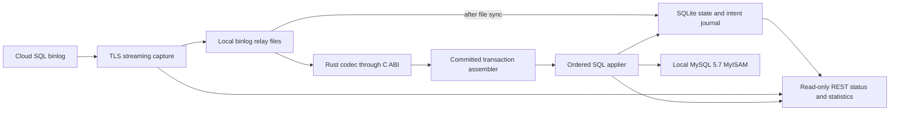
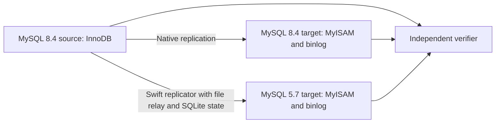

# Direct MySQL replicator — feasibility and phased POC

Research date: 2026-09-28. Input: [REPLICATOR_POC.md](REPLICATOR_POC.md) and subsequent user feedback. Repository baseline: `e0c242d`.

This plan records requirements and research, with current implementation evidence in [implementation status](IMPLEMENTATION_STATUS.md). Live read-only capture and the static Ubuntu container build are now qualified locally at checkpoint `d7725b2`; durable capture, target apply, fleet deployment and production throughput remain unqualified. No production databases were accessed. See the [reader/decoder decision and evidence](REPLICATOR_CODEC_DECISION.md). Version selections below are research pins, not recommendations to deploy those exact versions.

## Assessment

**Conditional GO for a bounded Swift POC. Production feasibility remains unproven.** A service beside each on-premises target can stream Cloud SQL binlogs, decode committed changes, and issue local SQL against MySQL 5.7. Swift is capable of the required networking, binary decoding, disk journaling and SQL application. The difficult parts are replication semantics, schema compatibility, MyISAM recovery and measured capacity, rather than the programming language.

The proposed replacement is a logical replication system. It must explicitly own responsibilities currently provided by Maxwell, Pub/Sub and the consumer: decoding, historical schema tracking, buffering, reconnect/replay, ordering, failure diagnostics and checkpointing.

**Implementation selected: Swift capture reader using MySQLNIO/SwiftNIO, plus Rust `mysql_common` decoding through our own C ABI.** Keep the rest of the service in Swift and statically link the codec. Port useful upstream test vectors, not the full decoder. This replaces the earlier plan to make the implementation choice after Phase 2.

**Follow-up to DML checkpoint `d188f58`:** production configuration must not contain
manual schema definitions. Discover source wire metadata and target schema
internally, then evolve that history in binlog order. Configuration filters are
separate later work. Replace per-group full-set serialization with durable applied
deltas and periodic GTID snapshots; timestamp and bound completed journal/history
retention without losing applied coverage or pending work. See [the concrete
schema/state follow-up](SCHEMA_DISCOVERY_AND_RETENTION.md). This supersedes earlier
manual-schema input requirements.

**Scope decision: database dump/load management is entirely external.** The replicator starts from an operator-supplied known file/position or executed GTID set, with matching source identity, scope and historical schema. It does not create, parse, transform, transfer, load or verify database dumps, orchestrate MySQL Shell, or rebuild targets. See [the start-boundary contract](START_BOUNDARY.md). Binlog streaming through the MySQL dump protocol remains core replication functionality.

Three corrections to the input assumptions determine the plan:

1. **MyISAM cannot provide the existing POC's transactional recovery guarantee.** The current applier requires InnoDB and commits each event's DML, ledger and checkpoint together. A MyISAM write does not roll back with that metadata transaction. Source transaction boundaries can be preserved for ordering, but wrapping target writes in `BEGIN`/`COMMIT` does not make them atomic or crash-safe. Whole-transaction atomic visibility and automatic recovery after every target/host crash are not baseline promises for this project.
2. **This is a read-heavy operational workload, not 3K–12K write transactions/s.** The user confirms that relatively few queries insert/update/delete and most modifying transactions touch only a few rows. The supplied snapshot is approximately 3K total QPS, with total traffic potentially reaching 10–12K QPS. Use short, small write transactions as the primary benchmark and retain large transactions as boundary tests. Actual write rows/s, bytes/s and bursts still need measurement; do not extrapolate a fixed write percentage from one screen. The previous POC's 26.65 initial-backlog events/s on an instrumented debug/QEMU setup is neither a production limit nor a capacity forecast. See [Phase 5 results](PHASE_5_RESULTS.md).
3. **Streaming reduces round-trip sensitivity but remains network-dependent.** A long-lived dump connection avoids a WAN SQL request for every row. WAN throughput, loss, reconnect delay and available source history still bound capture and recovery. Placing the applier near the target reduces SQL round trips; MyISAM table locking and disk/index work can still dominate.

Native newer-to-older replication is generally unsupported by MySQL. Cloud SQL's documented external-replica configuration requires a target version at least as new as its source. A custom client does not turn an 8.4 → 5.7 topology into a supported native topology; it implements a separately tested compatibility contract. [MySQL compatibility](https://docs.oracle.com/cd/E17952_01/mysql-8.4-en/replication-compatibility.html), [Cloud SQL requirements](https://docs.cloud.google.com/sql/docs/mysql/replication#prerequisites-for-creating-a-read-replica).

## Source review and implementation choices

Research clones are in ignored `.upstream/`. The current independent repository has a shallow full MySQL 8.4.8 checkout at `.upstream/mysql-server`; the original research used shallow, sparse server checkouts of replication/binlog code. The reader/connector clones are shallow full working trees. MySQL 8.4.8 matches the existing local fixture; MySQL 5.7.44 provides the final upstream 5.7 comparison. Neither is assumed to be identical to a Google build or the deployed on-premises package.

| Repository / local directory | Exact inspected commit | Relevant observations |
| --- | --- | --- |
| `mysql/mysql-server`, `mysql-5.7.44` | `f7680e98b6bbe3500399fbad465d08a6b75d7a5c` | `sql/rpl_slave.cc` couples XID processing with position updates and explicitly handles interrupted nontransactional event groups. `sql/log_event.cc` shows server-internal row application, not a reusable SQL client applier. |
| `mysql/mysql-server`, `mysql-8.4.8` | `0896fcd61dec11a0904166911a0126f59daaa1bf` | `libs/mysql/binlog/event/` contains event formats, table metadata, transaction boundary parsing, compressed payload handling and newer event types. `sql/rpl_binlog_sender.cc` and `client/mysqlbinlog.cc` are protocol/reference material. |
| `go-mysql-org/go-mysql`, `go-mysql` | `51f557e85dcd3345496cc0b89f69c2c6e02bd908` | Dump/GTID streaming, TLS configuration, optional checksum verification, row decoding, compressed payloads, partial updates, tagged GTIDs and heartbeat v2 have implementation paths. Parser defaults can produce generic events; the application still needs an explicit event policy. |
| `blackbeam/rust_mysql_common`, `rust_mysql_common` | `374c9d5c24f76a00b678d5b1d7103d6ceb4edb8c` | Protocol primitives and binlog value/event parsers, including partial-update and compressed-payload code. This is not a complete replication daemon or target applier. |
| `blackbeam/rust-mysql-simple`, `rust-mysql-simple` | `e5d282f98ab0e9b93537f74671a8f13102e2c4a5` | Streaming positional/GTID client inspected in the decision follow-up. Its public iterator returns decoded events, not original packet bytes; its binlog integration test primarily checks parsing and nonzero event counts. Not selected as the capture layer. |
| `apecloud/mysql-binlog-connector-rust`, `mysql-binlog-connector-rust` | `f7cca8ec2ebb55a1eb24c52702f9694c42d6a093` | Streaming and row decoding with optional TLS. Unsupported events return `NotSupported`; checksum bytes are skipped by `read_event_data`. Compressed payload parsing uses `while let Ok(...)`, which does not distinguish clean end-of-input from a nested parser error. These paths require correction/guards and negative fixtures before use. |
| `mariadb-corporation/mariadb-connector-c`, `mariadb-connector-c` | `be67a4fc1e0493913732df90e562f122bff9dfe3` | Direct C entry points `mariadb_rpl_open/fetch/extract_rows` are attractive for Swift interop. The inspected MySQL event enumeration ends at partial-update event 39, before payload 40, heartbeat v2 41 and tagged GTID 42. The inspected open path sends positional `COM_BINLOG_DUMP`. Full Oracle MySQL 8.4/GTID coverage must not be assumed. |
| Existing `vapor/mysql-nio` checkout, version 1.9.1 | `7fa853040169b604a16b963f23b481772f4ac181` | Public `MySQLCommand`/`send` extension points, TLS and `caching_sha2_password` handling exist. No ready-made binlog reader was found. The packet decoder emits physical packets; the replication command must establish correct continuation assembly, sequence behavior, cancellation and backpressure. |

These are inspected code paths, not interoperability certifications. The selected Rust codec now also has local test/ABI evidence described below. The optional MariaDB investigation focused on Connector/C because it is a plausible Swift dependency; the MariaDB server was not cloned. Its server replication dialect is not a substitute for testing Oracle MySQL streams.

Pinned evidence: [5.7 replica loop](https://github.com/mysql/mysql-server/blob/f7680e98b6bbe3500399fbad465d08a6b75d7a5c/sql/rpl_slave.cc), [8.4 event definitions](https://github.com/mysql/mysql-server/blob/0896fcd61dec11a0904166911a0126f59daaa1bf/libs/mysql/binlog/event/binlog_event.h), [8.4 transaction parser](https://github.com/mysql/mysql-server/blob/0896fcd61dec11a0904166911a0126f59daaa1bf/libs/mysql/binlog/event/trx_boundary_parser.cpp), [Go parser](https://github.com/go-mysql-org/go-mysql/blob/51f557e85dcd3345496cc0b89f69c2c6e02bd908/replication/parser.go), [Go stream client](https://github.com/go-mysql-org/go-mysql/blob/51f557e85dcd3345496cc0b89f69c2c6e02bd908/replication/binlogsyncer.go), [Rust primitives](https://github.com/blackbeam/rust_mysql_common/tree/374c9d5c24f76a00b678d5b1d7103d6ceb4edb8c/src/binlog), [Rust connector parser](https://github.com/apecloud/mysql-binlog-connector-rust/blob/f7cca8ec2ebb55a1eb24c52702f9694c42d6a093/src/binlog_parser.rs), [Rust compressed parser](https://github.com/apecloud/mysql-binlog-connector-rust/blob/f7cca8ec2ebb55a1eb24c52702f9694c42d6a093/src/event/transaction_payload_event.rs), [MariaDB API implementation](https://github.com/mariadb-corporation/mariadb-connector-c/blob/be67a4fc1e0493913732df90e562f122bff9dfe3/libmariadb/mariadb_rpl.c), [MySQLNIO command API](https://github.com/vapor/mysql-nio/blob/7fa853040169b604a16b963f23b481772f4ac181/Sources/MySQLNIO/MySQLDatabase.swift).

### Selected reader and decoder

Use MySQLNIO/SwiftNIO for the Swift capture reader's connection/TLS/authentication, adding tested binlog dump commands, framing, backpressure and cancellation. Persist exact event bytes in local relay/binlog files; keep coordinates, GTID sets, recovery state, diagnostics and statistics in SQLite. Pass complete bounded events to a small Rust adapter around the pinned `mysql_common` implementation. Its versioned C ABI returns typed records; Swift owns transaction assembly, historical schema policy, recovery, checkpoints and JSON rendering. No Rust network runtime is shipped.

The Rust source has 41 binlog fixture files and meaningful value/property assertions; a local explicitly enabled suite passed **26 tests**. A minimal Swift caller linked a Rust static library and decoded **21 events / 3 row images**, rejecting truncated, CRC-corrupt and oversized inputs. These host-only experiments establish test reuse and interop viability, not 8.4 production coverage or Ubuntu compatibility. Go vectors and the native MySQL harness remain independent oracles. Full findings, commands and limits are in [REPLICATOR_CODEC_DECISION.md](REPLICATOR_CODEC_DECISION.md).

| Option | Benefit | Cost / decision |
| --- | --- | --- |
| Swift reader + Rust `mysql_common` C ABI | Reuses the substantial event/value codec while retaining raw-byte capture and the existing Swift stack | **Selected.** Explicit adapter tests, metadata extension and matched Linux build required. |
| All-native Swift reader/decoder, porting Go tests | Good source of reference vectors and scenarios | Reimplements the larger value/event surface; no evidence the ported tests are a complete specification. Not selected. |
| Full Rust reader/decoder ABI | Existing positional/GTID reader | Would add a client/TLS stack and need a raw-packet API extension for durable capture. Not selected. |
| MariaDB C / ApeCloud Rust connector | Existing reader and decoding APIs | Inspected dialect, checksum or error-handling gaps outweigh the simplicity of binding them. Not selected. |
| Oracle C binlog client | Raw event streaming API | Does not replace the typed codec; adds another client dependency. Not selected. |
| Go reader through a helper or C ABI | Broad decoding/tests | Keep as independent harness tooling; avoid adding its runtime to the shipped executable. |
| MySQL server replication code | Authoritative behavior reference | Server/storage-engine coupling remains unnecessary for this client architecture. |

Required Rust adapter work: validate sizes and EOF; explicitly compare CRCs (upstream read stores but does not verify them); fail on unknown event results; handle/explicitly reject heartbeat v2; supplement absent signedness/charset metadata from historical schema; bound decompression and table-map state; catch unwinding panics at the ABI and invalidate failed contexts. Do not use the upstream `BinlogFile` iterator's truncated-input-as-EOF behavior. The upstream CI's main test command omits the `binlog` feature, so our CI must run `test,binlog` explicitly. These are qualification tasks for the selected implementation, not a deferred language decision.

The inspected Go license is MIT; the Rust crates declare MIT/Apache-2.0; MariaDB Connector/C includes LGPL-2.1; MySQL server source carries GPL terms. Record notices and dependency terms before distributing copied or linked code. This inventory is not a legal conclusion about a future build.

### Upstream tests to reuse as a coverage source

The existing research pins above also pin these inspected tests. Extract language-neutral inputs and explicit expected results, with origin path, test name, commit, fixture SHA-256, provenance/license and supported-or-rejected classification. Run the Rust upstream suite directly and port independent vectors to the C ABI and Swift-facing tests. Do not port a permissive parser loop or regenerate expected results using the Rust adapter under test.

| Source | Concrete test material | Swift coverage to derive |
| --- | --- | --- |
| [Go replication tests](https://github.com/go-mysql-org/go-mysql/tree/51f557e85dcd3345496cc0b89f69c2c6e02bd908/replication) | `row_event_test.go`: `TestDecodeDecimal`, `TestDecodeUnsignedIntegers`, `TestJsonNull`, `TestDecodeDatetime2`, `TestDecodeTime2`, optional table metadata and invalid rows. `event_test.go`: MySQL 8 GTID fields, previous GTIDs and heartbeat. `parser_test.go`: malformed/index-boundary cases. | Exact values, null bitmaps, signs, metadata and parser errors; select these as the first imported vectors. |
| Same Go pin, transport and compression | `packet/conn_test.go`: packet spanning/sequence mismatch; `transaction_payload_event_test.go`: payload decode and inner positions; `binlogsyncer_test.go`: close/unblock, rotate deduplication; `replication/testdata/fuzz/FuzzPreviousGTIDsDecode/`. | Reader framing versus event decoding as separate suites; cancellation, replay identity, compressed-event positions and malformed GTID corpus. Transport compression and transaction-payload compression are different features. |
| [Rust protocol fixtures](https://github.com/blackbeam/rust_mysql_common/tree/374c9d5c24f76a00b678d5b1d7103d6ceb4edb8c/test-data/binlogs) | Real files for full/partial rows, minimal metadata, JSON/opaque JSON, ENUM/SET, transaction compression, tagged/untagged GTIDs, truncated events and corrupt relay logs. `src/binlog/mod.rs` contains iterator/roundtrip/GTID assertions; `src/binlog/decimal/test/mod.rs` has generated decimal cases. | Offline corpus, positive/negative EOF handling, exact decimal boundaries and unsupported-feature rejection. Some fixtures are older MySQL, MariaDB or newer features: retain their actual provenance and do not count them as 8.4 interoperability evidence. |
| [Rust connector tests](https://github.com/apecloud/mysql-binlog-connector-rust/tree/f7cca8ec2ebb55a1eb24c52702f9694c42d6a093/tests) | `data_type_tests/`, `dml_tests/`, `ddl_tests/`; `parse_file_tests/mysql-bin.000057` and `mysql-bin.000080`. | Independent SQL workload ideas and historical file decoding. Replace the original count-until-error loop with exact event/value assertions and a clean-EOF assertion; this source's permissive error handling is not the intended Swift contract. |
| [MySQL test suite](https://github.com/mysql/mysql-server/tree/0896fcd61dec11a0904166911a0126f59daaa1bf/mysql-test) | Inspected `suite/rpl/t/rpl_row_basic_2myisam.test`, `common/rpl/rpl_mixing_engines.test`, `t/mysqldump_gtid.test`, `suite/binlog_gtid/t/binlog_gtid_mysqldump.test` and their available results. | Native MyISAM scenario structure, nontransactional behavior and dump/GTID initialization cases. The basic MyISAM test is a scenario source, not proof of our exact InnoDB-to-MyISAM topology. Regenerate the specific three-server cases below. |

Phase 1 creates the fixture catalog and selected Rust/Swift build; Phase 2 consumes it in Swift reader, Rust adapter, ABI and JSON tests. Record expected errors as first-class coverage, and add fresh files from the pinned 8.4 harness plus later Cloud SQL runs. When imported fixture provenance is unclear, regenerate its scenario instead of copying the bytes. Cross-check reference output against workload intent: two libraries agreeing is useful evidence, not an independent proof of correct behavior.

## Contract to settle before production work

Confirmed environment: **22 primary/MyISAM-replica pairs**. Targets run **Ubuntu 16.04 x86_64**, ranging from **2 CPUs / 16 GB RAM to 8 CPUs / 64 GB RAM**. The intended upgraded source is **Cloud SQL MySQL 8.4, Enterprise edition, HA**. Local relay/binlog files hold raw events; **SQLite** is the selected state, index, recovery-journal and diagnostics store. See [relay state and REST status](RELAY_STATE_AND_STATUS.md). Populate only the remaining per-pair facts during Phase 1; the POC can begin without production access.

Specify Enterprise explicitly: Google's current creation default for MySQL 8.4 is Enterprise Plus. Use `edition=ENTERPRISE` and regional HA in the future test configuration; record actual API settings, resolved patch version and effective flags instead of treating “current defaults” as a permanent version pin. Initial local settings must be compared with an unmodified default Enterprise 8.4 instance before any compatibility overrides are introduced. [Edition defaults](https://docs.cloud.google.com/sql/docs/mysql/choose-edition), [HA configuration](https://docs.cloud.google.com/sql/docs/mysql/high-availability).

| Area | Required facts / initial policy |
| --- | --- |
| Topology | 22 primary/MyISAM-replica pairs. Record instance/schema/filter mappings for each pair. One ordered stream per source instance; coordinate cross-schema transactions within that stream. No global order across independent primaries. |
| Source | Enterprise 8.4 with HA is selected. Record exact current 5.7, intermediate-upgrade and resolved 8.4 patch versions; engines; GTID settings; binlog format/image/metadata/checksum/compression/JSON defaults and maintenance behavior. |
| Tables | Keys, key changes, row widths, charsets/collations, ENUM/SET, JSON, binary/spatial/generated columns, indexes, partitioning and all DDL used by deployments. Inventory tables without a reliable unique key. |
| Target | Ubuntu 16.04 x86_64, 2 CPU/16 GB through 8 CPU/64 GB. Still collect exact 5.7 build/kernel/filesystem, per-host sizing, MyISAM settings, local read traffic, triggers/events/local writes, binlogging/GTIDs, disk throughput and repair/rebuild duration. Keep replicated tables single-writer. |
| Load | Read-heavy operational workload with mostly few-row modifying transactions. Measure committed write transactions/s, changed rows/s, binlog bytes/s, p50/p95/p99/max transaction bytes/rows, bursts, hot keys/tables, DDL and reader contention over a complete business cycle. |
| Service objectives | Required steady-state lag, outage window, catch-up time, disk budget, permissible reader blocking, recovery time, and whether partial transaction visibility is acceptable. No numeric production SLA is inferred from the brief. |
| Deployment | Qualify the executable on Ubuntu 16.04 x86_64 early, including SQLite, TLS and service management. Record network/TLS path, certificate rotation, credential delivery and operator ownership. A build on a newer Ubuntu version is not a deployment test. |

GTID environment confirmed in the implementation follow-up: retain `gtid_mode=ON` and `enforce_gtid_consistency=ON` on the source for compatibility with the intended cloud deployments. Configure both POC targets with `gtid_mode=OFF_PERMISSIVE` and `enforce_gtid_consistency=WARN`. Treat these as separate settings; `WARN` is an enforcement policy, not a GTID mode. Production effective settings must still be checked. See [GTID qualification](GTID_QUALIFICATION.md).

Baseline source contract: row-based DML, full before/after row images, CRC32 verification where enabled, no partial JSON values or transaction compression until implemented and tested, and explicit rejection of XA/tagged GTIDs/other unsupported features. Check settings at connection time and actual event types continuously. A global flag check alone cannot certify every historical event or session.

Baseline table contract: stable primary keys, supported exact value types, explicit source-to-target schema mapping and no target triggers or autonomous writers on replicated tables. Expand only against observed fleet requirements. Tables without keys are a gate, not permission to update the first matching row.

Native row replication and client SQL are different execution paths: client SQL can fire target triggers and apply SQL-mode/default/type conversions. The existing native replicas' trigger behavior must be inventoried before replacing their applier. Source-generated values should be applied explicitly; preserve decimal/unsigned/binary/temporal values without floating-point round trips. Do not silently map 8.4 collations to a 5.7 collation with different comparison/uniqueness behavior.

## Proposed runtime



Use one supervised instance per independent stream initially. Suggested Swift modules are `BinlogTransport`, `BinlogCodec` (safe wrapper over `CBinlogCodec`), `RelayStore`, `ReplicationState`, `SchemaHistory`, `MyISAMApplier`, `ReplicatorRuntime`, `StatusServer` and a new harness target. A separate Rust static-library package implements the versioned C header and wraps `mysql_common`; Swift's schema history supplies missing authoritative decode metadata through that API. Reuse value binding, quoting, deterministic workload generation and report conventions from this repository. Do not route direct-binlog data through fabricated Maxwell JSON identities or carry over the InnoDB guard as an engine-name substitution.

The C ABI uses opaque contexts, fixed-width tags and pointer/length byte views with matching Rust release functions. It exposes typed exact values and structured errors, not Rust layouts or production JSON serialization. Each context is called serially off the NIO event loop; raw relay bytes and all source checkpoints remain Swift-owned. Bound each frame/batch and invalidate context after fatal errors. See the [ownership and test contract](REPLICATOR_CODEC_DECISION.md#abi-and-ownership-contract).

### Capture, positions and relay

- Establish verified TLS/authentication, a unique replication client server ID and a dedicated long-lived dump connection. Use a separate connection for metadata/control queries. Prototype `COM_BINLOG_DUMP`, then GTID auto-positioning; GTID is required for the intended production path where configured. Never obtain privileges by weakening production authentication.
- Store source-history identity, endpoint identity, server UUID observations, file/position, GTID set intervals, decoder/schema versions and checksums. A GTID set is not one monotonically increasing integer. Target-local `gtid_executed` is not the application's source checkpoint.
- Distinguish received, durably captured, and fully applied progress. Resume capture from durable relay state, or from the applied boundary if the unconsumed relay is lost and source history still exists. Never resume from a library's in-memory “last received” value after process loss.
- Store ordered raw event frames in local files. Synchronize file data and required directory entries before committing referenced durable lengths, source coordinates, checksums, completeness indexes and safe capture progress in SQLite. Keep raw event payloads out of SQLite. On restart, verify manifest references and recover or discard unacknowledged file tails; file append and SQLite commit are not one atomic transaction. Resume at a complete transaction boundary, preserving format/table-map context or rereading it; never exclude an incomplete transaction's GTID when reconnecting. Persist large transactions in bounded chunks without marking them complete early.
- A durable relay can continue capturing during transient target outages. Stop capture with visible backpressure if disk limits are reached; do not discard old unapplied records. Purge records only under a retention rule consistent with applied state and the chosen recovery contract. Permanent incompatibility stops the pipeline as specified below.
- Treat source purging, unexplained identity changes, divergent history or unavailable required GTIDs as blocked/reseed-required. On known HA transitions verify lineage and GTID coverage rather than requiring an unchanged UUID or trusting the endpoint name. Heartbeats indicate connectivity, not application progress.
- Pin local file bytes for every blocked event; keep its file reference, coordinate, schema version and reason in SQLite. Stop later application, retain a reproducible repair input and expose unhealthy status. No automatic skip-on-error mode.

The relay replaces part of Pub/Sub's buffering role, but local disk failure remains a separate failure domain. It cannot preserve uncaptured binlogs or make MyISAM durable.

### SQLite storage and Ubuntu deployment

Use one local SQLite database per pair for relay file manifests/indexes, transaction boundaries and GTID sets, schema history, row/DDL intents, checkpoints, update times, externally supplied start-boundary provenance, diagnostic/counter snapshots and blocked/resume history. Raw binlog payloads stay in local files. See [the storage ordering, recovery and REST contract](RELAY_STATE_AND_STATUS.md). Start with one serialized SQLite writer on a dedicated execution queue; keep filesystem work off NIO event loops. SQLite transactions may make changes within this database atomic; they cannot include relay-file appends or MyISAM mutations.

Use `journal_mode=WAL` and `synchronous=FULL`, verifying settings on every writer connection. SQLite documents a WAL synchronization on each commit with FULL; NORMAL does not offer the same power-loss durability. Use a local filesystem, short status-reader transactions and monitored WAL checkpoints. Back up through SQLite's supported backup mechanism or a verified stopped/checkpointed procedure, not a live copy of just the `.db` file. [SQLite WAL behavior](https://www.sqlite.org/wal.html).

Application policy: persist intent before SQL, then completion after reconciliation; do not hold a SQLite write transaction across a MySQL network wait. Treat SQLite full/I/O/corruption errors as fatal to progress. If diagnostics cannot be persisted there, report to stderr/system logs and stop without claiming a durable checkpoint. Bound database plus WAL disk use, checkpoint latency and retention; deletion may make pages reusable without shrinking the file. Test busy/long-reader conditions, interrupted commits, WAL recovery, backup/restore and disk exhaustion. Record the linked SQLite version and compile options; choose a maintained pinned build for the executable instead of relying implicitly on the host's system library. WAL checkpointing and source replication checkpointing must have distinct metric names.

Ubuntu 16.04 is absent from current Swift Ubuntu downloads. The [container packaging spike](UBUNTU_PACKAGING_RESULTS.md) now cross-builds with Swift 6.2.1 and the matching Static Linux SDK, and runs the actual dependency stack in Ubuntu 16.04 x86_64 userland under Docker’s modern kernel. In Phase 1, build the x86_64 Static Linux SDK route with the actual NIO/TLS/SQLite and Rust codec/zstd dependencies, then execute it on an Ubuntu 16.04 VM with the fleet's kernel class. Build Rust and Swift against compatible musl targets; do not mix glibc and musl archives. Pin compiler/SDK versions, Cargo.lock and native link inputs. The production Rust dependency excludes the upstream `test` feature and its MySQL C++ decimal reference libraries. The SDK may require C dependency adaptations; static linking does not certify kernel compatibility. Test DNS, CA loading, TLS validation, timers, file locking/fsync and service restart. A modern container on the same old kernel also requires qualification. If neither deployment path works, record the required dependency/host change before expanding implementation. [Swift Ubuntu downloads](https://www.swift.org/install/linux/ubuntu/), [Static Linux SDK](https://www.swift.org/documentation/articles/static-linux-getting-started.html).

### Runtime status and statistics

Implement a versioned read-only REST API on the running service for status, statistics and bounded diagnostics. Include current stream state and update times; received, durable and applied file/position and source GTID sets; pending transaction/intent; transactions/rows applied, bytes/events received/captured, reconnect attempts/successes and disconnects. Keep exact progress independent from periodically persisted diagnostic counters. Use coherent snapshots and short reads so a slow client cannot pin the SQLite WAL or block replication. See [endpoint contracts, retention and tests](RELAY_STATE_AND_STATUS.md#statistics-and-read-only-rest-api). The API is added after the initial capture/apply state is established; completing capture-only REST is not a prerequisite for the first applier.

### JSON inspection mode

Provide a read-only `inspect` subcommand using the same Swift transport and Rust C-ABI codec as replication, rendering their typed records to JSON in Swift. The initial file-only command is now `mysql-replicator inspect FILE --schema HISTORY.json`; see [offline inspection](OFFLINE_INSPECT.md). The following broader interfaces remain proposed Phase 2 interfaces, not current CLI syntax:

```sh
mysql-replicator inspect --source-config source.toml --start-position mysql-bin.000123:456 --format ndjson
mysql-replicator inspect --binlog-file captured.binlog --format ndjson
mysql-replicator inspect --state replica.sqlite --event-id EVENT_ID --format ndjson
```

The state-indexed form locates bytes in pinned local relay files; SQLite contains references and metadata, not event BLOBs.

Emit one versioned JSON object per event, with source identity, file/start/end positions, event type/header, GTID, transaction/row ordinal, schema version, table/column metadata and typed before/after values. Emit control/DDL/commit events as well as rows so a trace can explain boundary decisions. Distinguish an observed uncommitted row event from a completed source transaction. Encode uint64/decimal values as tagged strings, binary as base64, and SQL NULL, JSON null and missing columns distinctly; preserve temporal precision and raw type information. Full metadata may be unavailable in old files: accept a schema manifest or show column ordinals/unknown fields without guessing names or querying today's schema.

Keep stdout exclusively NDJSON and diagnostics on stderr. Support bounded ranges, GTID starts for live capture, raw-byte inclusion by explicit option and safe read-only access to SQLite. Inspect mode never writes target SQL, changes apply/checkpoint state, or registers itself as the production applier. On unsupported/corrupt input, emit an identifiable error with coordinates and exit nonzero rather than reporting a partial file as successfully decoded. Golden JSON fixtures must exercise live, file and state-indexed relay paths, exact numeric/binary values, truncation and unknown metadata. Credentials never enter output; raw row output is an explicit debugging artifact and may contain application data.

### Stop, diagnose, repair and resume

**Accepted initial compatibility scope:** native GTID-to-MyISAM behavior is the reference. For reproducible native-failing cases, Swift may also reject and stop; making those cases succeed is not required initially. Positive cases within declared support must match expected/native logical effects. See [the native-reference contract](NATIVE_REFERENCE_CONTRACT.md) for outcome classification and phase gates. The known error-1837 multi-statement case is an expected negative reference, not a prerequisite to redesign source transactions or fix MySQL.

For incompatible/unknown required events, unsupported DDL/types, schema drift, missing rows or SQL apply errors classified as permanent: persist a `BLOCKED` diagnostic, stop application and capture, emit an error and leave the read-only status service available in service mode; non-service runs exit with a dedicated nonzero status. Pin raw bytes in relay files and store their references, source and target identities, GTID/position, transaction/row progress, schema, SQL error code/state where present and tool version. Record any earlier MyISAM writes in the current transaction; stopping does not undo them. A later event must not apply or advance the completed-transaction checkpoint.

This follows native MySQL's stop-on-apply-error operational model without promising identical numeric error codes or the same supported feature set. Native replication may keep its I/O thread running after an SQL-thread error; this tool deliberately stops both on permanent incompatibility. Transient connection failures retain bounded-backoff reconnect behavior and the existing uncertain-outcome checks.

The proposed `status --json` command and read-only REST API expose last error, blocked coordinates and received/durable/applied progress. Service mode keeps status available after capture/apply workers stop in BLOCKED state. A proposed `resume --diagnostic-id ID` command validates the operator's schema/data/configuration/code fix, reacquires ownership and retries the stored event at its recorded progress. Failed repair leaves the block intact; successful repair records resolution and continues in order. Restart alone does not clear a permanent block. Configure the service manager to preserve the durable block across restarts; a non-service failure exit must not cause an uncontrolled restart loop. No implicit skip, altered payload, checkpoint jump or duplicate-key suppression is a repair. Test native-versus-Swift failure categories where both support the same operation, and Swift-only rejection where 8.4 can handle a feature unavailable on 5.7.

### Native replication exclusion

Before initialization, apply-mode startup, resume and target reconnect, inspect **all target replication channels**. On 5.7 use `SHOW SLAVE STATUS` plus channel/worker status where needed; on 8.4 fixtures use the corresponding `SHOW REPLICA STATUS` interface. Refuse to proceed if any receiver is running or connecting, or any applier/coordinator/worker is running. Refuse on missing privilege, failed query or indeterminate state; an empty result is safe only after successful channel enumeration. `Slave_IO_Running=Connecting` is a running receiver. [5.7 status semantics](https://docs.oracle.com/cd/E17952_01/mysql-5.7-en/show-slave-status.html).

Retained stopped channels require an explicit completed handoff record bound to this target/source boundary. Provision `skip-slave-start` on the production 5.7 target (`skip-replica-start` on 8.4 fixtures), confirm it in preflight, and remove automatic native-replication start actions from service automation. The replicator does not silently stop/reset native channels. Acquire its own target advisory lock and recheck channel state before writes; continue monitoring while applying. Native replication does not honor that advisory lock, so administrative `START SLAVE/REPLICA` must also be excluded by operational ownership/privilege controls. Polling alone cannot eliminate that race. Read-only inspection may run alongside native replication because it has no target writer.

### Transactions, schemas and DDL

Assemble complete committed source transactions before scheduling target writes. Recognize autocommit/DDL boundaries as well as explicit `BEGIN`/XID/COMMIT; do not infer a commit from a row-event statement-end flag. Ignore rolled-back transactional source work. Either reject nontransactional/mixed source workloads initially or give them a separate verified contract; their rollback behavior differs.

For the OFF_PERMISSIVE/WARN Swift target, initialize every new/reconnected Swift apply connection with `SET @@SESSION.GTID_NEXT = 'AUTOMATIC';` before issuing target SQL, producing target-local anonymous transactions. This is a session setting and does not reset a separate native applier; native channels still take GTIDs from source events. The Swift applier must not set an explicit source GTID for target statements. Source GTIDs remain exact identities and recovery checkpoints in SQLite; do not inject the source GTID into multiple target MyISAM statements or use target `gtid_executed` as proof of complete source-transaction application. Test target binlogging explicitly. Native qualification demonstrated that a source GTID can appear executed after only part of its source transaction affected MyISAM; only verified completion of all required row operations may advance the Swift applied checkpoint.

Keep source order across tables and schemas. Start serially; parallelize independent source instances first. Any within-stream concurrency requires dependency ordering, DDL barriers, key-change handling and a contiguous fully completed checkpoint. GTID identity alone establishes none of these.

Table-map events supply binary types and some metadata, not a complete timeless schema catalog. Persist schema versions at the bootstrap/cutover boundary and apply schema changes in binlog order. Looking up the source's current `information_schema` while replaying an older row can decode/apply against a later schema. Optional full row metadata helps but does not replace DDL history. Invalidate table-ID mappings at their protocol-defined boundaries and test reuse after rotation/reconnect/drop/recreate. [8.4 table-map definitions](https://github.com/mysql/mysql-server/blob/0896fcd61dec11a0904166911a0126f59daaa1bf/libs/mysql/binlog/event/rows_event.h).

DDL needs a dedicated compatibility policy and before/after journal. Start with the previous POC's narrow DDL subset, with an explicit target-engine mapping to MyISAM. Validate target support for each type/index combination. Expand for actual fleet migrations, including rename/truncate/modify only when separately tested. Implicit commits, partially completed table changes and engine conversions require independent recovery decisions. Never execute arbitrary source SQL on 5.7 and assume compatibility.

### MyISAM recovery: the first decisive gate

For InnoDB, data plus metadata can share a transaction. For MyISAM, a process can die after a row changes but before the journal advances. A later mysqld/OS failure can also leave metadata durable while older table writes are lost or indexes need repair. An InnoDB metadata table or SQLite journal does not close that gap. MySQL's own replica code warns about incomplete nontransactional groups; mixed-engine GTID restrictions also make simply wrapping MyISAM data and InnoDB metadata in one transaction an invalid design in some target configurations. [5.7 replica implementation](https://github.com/mysql/mysql-server/blob/f7680e98b6bbe3500399fbad465d08a6b75d7a5c/sql/rpl_slave.cc), [GTID restrictions](https://docs.oracle.com/cd/E17952_01/mysql-5.7-en/replication-gtids-restrictions.html).

Proposed initial recovery contract:

1. Durably record source transaction bytes and the next exact row intent before mutating MyISAM. Record full expected before/after state and schema identity. Permit only one outstanding row mutation initially.
2. With mysqld continuously running and exclusive applier ownership, reconnect after an uncertain SQL outcome, fence/finish the previous connection, and inspect the row. An exact before-state permits application; an exact after-state permits recognizing the outstanding operation as already applied. Other states block. Account for changed primary keys by inspecting both old and new keys, and distinguish absence from NULL.
3. Durably record row completion before starting the next row; advance the transaction checkpoint only when every operation is accounted for. Repeated updates, delete/reinsert, key reuse and transactions touching the same key require dedicated tests. Per-row durable journaling may be expensive; measure it before relaxing it.
4. Do not replay arbitrary historical INSERT/UPDATE/DELETE as unconditional upserts. An old replay can overwrite newer state; `REPLACE` can invoke delete/insert behavior and affect other unique keys. Before/after reconciliation applies only to the known outstanding intent under the ordered, fenced recovery protocol.
5. On target mysqld restart, host loss, uncertain journal integrity or detected MyISAM damage, initially block serving this target as verified and require validation/reseed. A clean-shutdown optimization needs a demonstrated flush/checkpoint handshake. An abrupt-recovery extension must establish a trustworthy data boundary and a bounded reconciliation/rebuild procedure before automatic resume is allowed.

The supervisor must track target process lifetime conservatively; ambiguous disconnects cannot prove mysqld stayed alive. Reacquire a target writer lock on the applying connection after reconnect, and ensure the previous connection cannot continue writing. Startup must refuse concurrent native replication or another custom writer on the same tables. A local lock file alone is insufficient fencing.

Readers may observe a partially applied source transaction, including after an applier crash. MyISAM table locks can limit visibility while held, but their release on failure does not provide rollback. If readers require atomic multi-table source transactions, retaining MyISAM with this direct in-place design is a **NO-GO**; evaluate transactional targets or a separately designed publication mechanism. If automatic lossless recovery from arbitrary target crashes is mandatory without rebuild, this baseline is also a **NO-GO**.

## Phased implementation and exit gates

Every phase produces a results document, machine-readable pass/fail results and retained evidence. Unsupported infrastructure is a failure or an explicit outstanding gate, never a passing skip. The phase descriptions are requirements; implemented SwiftPM/Make entry points and current validation are tracked in [Phase 1 progress](PHASE_1_PROGRESS.md). Repository automation is owned by SwiftPM executables/tests, with Make used to coordinate Cargo and Swift builds.

**Execution order after `d7725b2`:** deliver a narrow Phase 3 serial applier now, interleaving only the Phase 2 relay/SQLite support required for retained bytes, row intents and applied checkpoints. First prove INSERT/UPDATE/DELETE correctness against source intent and the native reference. Next bring forward the relevant Phase 4 schema work: implement and verify supported DDL, historical-schema updates and DDL interleaved with DML. Only after both DML and DDL are solid, implement and qualify crash/reconnect recovery with real target writes, uncertain outcomes, DDL boundaries and applied progress. Capture-only storage tests remain useful component checks but do not constitute the next recovery milestone or end-to-end recovery evidence. REST status follows the initial capture/apply state. The phase numbers group requirements; completing every Phase 2 recovery/API gate is not a prerequisite to starting this applier. See [the next increment](START_BOUNDARY.md#next-implementation-increment).

### Phase 1 — independent harness and workload inventory

Build the harness before the direct reader, with this **mandatory three-server topology**:



The native 8.4 branch is a behavior reference for both success and expected failure, and the Swift 5.7 branch is the system under test. Until the Swift applier exists, record reference results and leave the Swift-apply gate explicitly pending. Add 5.7 source/intermediate-upgrade fixtures and an InnoDB control as secondary scenarios; preserve the Maxwell suite.

Pin both 8.4 versions consistently and the 5.7 fixture version separately. Give every server/client a unique server ID and fresh history identity. Use `log_bin=ON`, row format, full row images and checksums on all three; enable `log_replica_updates=ON` on the native 8.4 replica. The Swift SQL connection must have `sql_log_bin=1` during measured application, so its actual target mutations generate 5.7 binlogs. Record GTID and durability settings explicitly; start with serial native apply/commit order and strict error handling, without skip-errors/idempotent-error suppression. [Replica update logging](https://dev.mysql.com/doc/refman/8.4/en/replication-options-binary-log.html#sysvar_log_replica_updates).

The required GTID fixture uses source ON/ON and both targets OFF_PERMISSIVE/WARN (`gtid_mode` / `enforce_gtid_consistency`). Establish a verified common post-seed boundary and use `SOURCE_AUTO_POSITION=1` on the native channel. The disposable harness appends the exact source snapshot GTID set to the native target's `gtid_purged` after verifying seeded application rows; this is fixture provisioning before any workload, never an apply-error workaround. Production target preparation is external; the replicator accepts the known boundary under the Phase 4 handoff contract. Retain file/position as an explicit diagnostic mode; it does not require disabling GTIDs. Test an InnoDB native control separately. Do not count a control pass or successful receiver connection as MyISAM compatibility. The current OFF_PERMISSIVE/WARN MyISAM test reproduces error 1837, and the user now accepts this as a negative reference with partial effects recorded; Swift may also stop on the corresponding unsupported case. Exact file/position startup and an AUTOMATIC reset through init_replica also fail for that workload. The same DML as separate source commits passes into MyISAM; retain this as a restricted positive reference while preserving the multi-statement case as a required failure/compatibility scenario. Do not infer support for all MyISAM or multi-row workloads from either result. See [positional GTID experiments](POSITIONAL_GTID_RESEARCH.md).

Seed the same application schema/data into both targets with explicit MyISAM mapping, then start both at the same **post-seed source boundary**. Assert actual engine types through `information_schema` before workloads and after DDL. A native replica can retain a different engine for row application, but replaying `CREATE TABLE ... ENGINE=InnoDB` can undo that setup; setting only its default engine does not override explicit DDL. Begin with DML and engine-preserving ALTER cases. Phase 4 separately classifies create/recreate/engine DDL instead of silently changing the reference branch to make it pass. [Cross-engine replication behavior](https://docs.oracle.com/cd/E17952_01/mysql-8.4-en/replication-features-transactions.html).

Reuse the host-owned Compose lifecycle, deterministic writer, independent expected-operation manifest, evidence capture and negative assertions. A Go reader plus version-matched `mysqlbinlog` supplies reference decoding/capture; neither alone is the correctness oracle. Compare source committed intent, ordered decoded operations and modeled target state. Give assertions explicit transaction, schema and engine identities.

Compare at quiesced/barrier-aligned boundaries in three layers:

1. Exact modeled/source/native-target/Swift-target rows and normalized schemas, retaining engine differences as explicit expected mappings. SQL readback is mandatory: the native replica's re-logged events can describe source operations without independently proving its table contents.
2. Decode all three servers' binlogs into ordered logical DML/DDL records. Compare table/key, exact before/after values, operation multiplicity, transient insert/delete history and ordering. Exclude only explicitly recorded setup/observer/diagnostic traffic using boundary and table filters.
3. Produce a separate behavior report for source/native/Swift transaction boundaries, partial visibility, errors and recovery. Native re-logging can retain source GTIDs; Swift-issued SQL can generate local GTIDs and split a source transaction into multiple target statements/groups. Use source transaction/row identity from the intent manifest and SQLite mapping to correlate them; do not overwrite target GTID state to force a match. With one writer, retain target binlog ranges and SQL-attempt provenance for ambiguous outcomes.

Do not compare byte-for-byte binlogs: server UUIDs/IDs, GTIDs, timestamps, positions, table IDs, header versions and event grouping can differ. Normalization must preserve row operations and values, and enumerate every allowed difference. No-op UPDATE logging, partial failed statements and restart/replay may differ; give each a dedicated expected-effects case rather than erasing discrepancies globally. Introduce missing/duplicate/reordered/wrong-value mutations into comparator input to prove it detects them.

Add real process-kill, connection-cut, disk-full and source-rotation controls, plus independently issued target reads. Establish tests for repeated keys, insert/delete pairs absent from final state, rollback, changed keys and DDL immediately followed by data. Keep missing-event/wrong-value self-tests and add an incorrectly advanced checkpoint self-test.

Catalog the upstream test sources above, establish the pinned Rust adapter package/C header/Swift wrapper, and make the Ubuntu 16.04 x86_64 packaging spike a Phase 1 deliverable. Reproduce the 26-test upstream run with `test,binlog`, then strengthen the minimal ABI probe into ownership/error/value tests; the local research probe is not production code. Establish low-end/high-end test profiles matching 2 CPU/16 GB and 8 CPU/64 GB hosts, with a separate budget for MySQL and replica readers rather than granting the replicator the full host memory.

**Exit:** declared positive reference cases replicate actual InnoDB changes into verified MyISAM tables and emit captured binlogs; expected negative cases assert the cataloged error, failing transaction, stopped apply and actual partial effects without requiring native success; comparators catch each deliberate corruption; MyISAM fixtures prove rollback cannot undo a write; offline reference fixtures and the upstream coverage catalog are reproducible. Produce `REPLICATOR_PHASE_1_RESULTS.md`, corpus/manifest, deployment-spike report and remaining per-pair inventory. Swift-apply parity awaits Phase 3. Missing production measurements block capacity conclusions, not local harness work.

### Phase 2 — Swift reader and Rust codec qualification

Offline preparation now includes ABI 3 typed controls and bounded Swift transaction assembly with strict EOF/physical-coordinate checks. See [transaction assembly](TRANSACTION_ASSEMBLY.md) for implemented scope. Boundary candidates are not durable checkpoints. Live dump-protocol framing/pseudo-events are now qualified for the declared subset at `d7725b2`. The storage component must synchronize local relay bytes before publishing their references and progress in a SQLite transaction, initialized from a caller-supplied known boundary. Build the minimum needed alongside the first applier; qualify its crash protocol with the end-to-end recovery increment before claiming safe resume.

Implement capture-only Swift streaming with MySQLNIO TLS/authentication reuse against the GTID-ON source; qualify GTID auto-positioning and transaction-boundary resume as required behavior. Keep positional resume as a diagnostic/control path. Preserve complete raw event bytes before decoding through the selected Rust adapter. Complete its bounds/CRC/error guards, historical column-context extension and typed C ABI; do not write a parallel Swift row decoder. Keep this capture component read-only; target mutations belong to the Phase 3 applier developed alongside its minimum storage support. Implement local relay-file persistence/replay with SQLite state/indexes and all three JSON `inspect` input paths. Add read-only REST status, diagnostics and counters after the initial capture/apply state is established; explicitly mark apply progress unavailable in capture-only mode. The inspection CLI is an early deliverable usable before the applier exists.

Cover format description, rotate, table map, write/update/delete rows, query boundaries/DDL, XID, GTID/previous-GTID and heartbeats. Exercise CRC failure, unknown event types, fragmented packets, sequence wrap, packets/events larger than 16 MiB, truncated input, missing table maps, disconnect halfway through a transaction, large transaction spill and bounded decompression. Compression/partial JSON/tagged GTIDs/XA must either pass dedicated fixtures or reliably stop before advancing applied state. Do not treat a generic/unsupported library event as harmless by default.

Differentially compare normalized values and transaction identities against the Go reader and independent workload manifest. Use `mysqlbinlog` as a human-readable format check, not as a lossless SQL/value serialization format. Fuzz length/offset/null bitmap and compressed-payload boundaries through the Rust C ABI under strict resource limits. Add lifetime/sanitizer, invalid-argument, create/free/reset, context-poisoning and exact value-transfer tests; specifically cover missing optional signedness metadata with UINT64_MAX and verify EOF is never inferred from a parser error.

Preserve source statement boundaries separately from transaction boundaries for the Phase 3 compatibility classifier; never classify a transaction solely by its row count. Valid decoded input may still be unsupported for target application.

Publish a coverage matrix linking each supported/rejected event/type/transport behavior to imported vectors, locally generated 8.4 fixtures and Swift tests. Require the same expected typed NDJSON for equivalent live/file/state-indexed relay input, apart from explicitly volatile observation fields. Include uint64/decimal precision, base64 binary, SQL-versus-JSON null and incomplete source transactions. Test relay-file/SQLite recovery across append/fsync/metadata-commit/rotation/purge crash windows, incomplete captured transactions, disk full, corruption, missing-file re-download and purged history. Test WAL checkpoint pressure and bounded concurrent REST/inspection readers. The required state fields, counters and API routes are in [relay state and REST status](RELAY_STATE_AND_STATUS.md).

**Exit:** exactly the expected committed operations survive reconnect/replay; explicit upstream binlog tests, imported/local corpus, C ABI ownership/error tests and JSON golden tests pass; malformed/unsupported input produces a diagnostic and nonzero exit; file-relay and SQLite state recovery are bounded, and live REST status/counters distinguish received, durable and applied progress. The release executable with actual Rust/Swift dependencies must pass Ubuntu 16.04 x86_64 smoke tests. Report codec/ABI allocation and throughput measurements. The implementation choice is already made; reopen it only for a demonstrated blocker recorded in the decision document.

### Phase 3 — ordered apply and MyISAM recovery decision

Deliver the next work in three increments: (1) serial INSERT/UPDATE/DELETE with source/native/Swift row and binlog comparisons; (2) supported schema changes, historical-schema updates and interleaved DDL/DML correctness, bringing relevant Phase 4 work forward; (3) only after the first two gates pass, crash/reconnect recovery implementation and the full failure matrix below. Interrupted/uncertain apply stops for explicit handling until the third increment is qualified; there is no earlier automatic retry/resume claim.

Implement the cataloged native-reference compatibility policy, rejecting recognized unsupported transaction shapes before target writes where possible. An earlier Swift rejection is allowed; deliberately reproducing native partial effects or numeric error 1837 is not required. Journal any actual partial writes and retain the previous completed-transaction applied checkpoint. Never inject source GTIDs into target SQL to manufacture a matching error.

Implement serial DML for the initial key/type subset, SQLite row intents referencing pinned relay bytes, completed-transaction file/position and source GTID sets, exact reconciliation, fencing and persisted blocked/resume state. Update exact applied counters with the completed checkpoint and expose pending/blocked/applied state through the REST API. Enable the Swift branch of the three-server harness and compare data, normalized binlog effects and behavior against the native 8.4 branch. Use the optional InnoDB control for engine-specific investigations. Implement the declared DDL subset as the second increment and require schema plus interleaved DML correctness before recovery work begins. Journal DDL boundaries so the later recovery implementation does not assume every commit is XID.

Kill the replicator before/after intent durability, before/after each SQL write, after target response but before journal completion, and around transaction checkpoint publication. Break the connection with an unknown SQL outcome. Cover multi-row partial SQL failures, changed keys, duplicate keys, repeated same-key updates, a later event behind a poison event and a second writer attempting takeover. Restart mysqld independently and verify that the initial conservative block/reseed policy activates.

Make native-exclusion tests mandatory: active SQL thread, active or connecting I/O thread, a second channel, worker activity, missing status privileges, stopped-but-unadopted channel, properly handed-off channel and auto-start after mysqld restart. Startup refusal must occur before target mutation or checkpoint movement. Exercise the administrative-start race and document the ownership controls required to prevent it.

For permanent errors, assert the diagnostic survives restart, the failing transaction remains incomplete, and following writes never apply. Compare missing-row/duplicate-key/schema error categories with a deliberately broken native branch; do not demand that native 8.4 reject Swift-only unsupported features. Repair the cause, explicitly resume, and prove the original operation continues exactly once in effect while all prior MyISAM mutations remain accounted for. An unfixed resume must fail again. Preserve diagnostics in SQLite and demonstrate inspection with the JSON CLI.

**Exit:** supported positive scenarios agree across all three servers in rows and normalized binlog effects; expected negative scenarios assert Swift durable block, source identity, actual partial state, unchanged applied completion and no following target writes, with any earlier Swift rejection explicitly allowed by the case; differences in grouping/visibility are documented; native-exclusion and human repair/resume tests pass. All applier-only interruption cases converge within contract; uncertain target-crash cases stop visibly. Publish the failure/visibility matrix and SQLite durability overhead. Decide whether the contract meets replica consumers' needs before capacity qualification and fleet rollout.

### Phase 4 — fleet schema coverage and externally prepared target handoff

Bring the required schema-change implementation and correctness cases from this section forward immediately after the DML applier, before crash/reconnect recovery work. Further fleet-specific expansion and external-boundary qualification remain ongoing gates.

Expand values and DDL using the inventory: unsigned boundaries, exact decimals, binary/Unicode, SQL versus JSON null, time fractions/timezones, ENUM/SET and actual index definitions. Test unsupported input as carefully as supported input. Verify source/target schema equivalence under explicit engine/compatibility mappings.

Classify each DDL case as native-equivalent, an explicit target-engine/schema transformation, or unsupported-and-blocking. For create/recreate with explicit InnoDB, the native reference may legitimately change engine while Swift's declared mapping produces MyISAM; report that difference and assert each expected result. Keep such experiments separate from the all-MyISAM parity suite. Do not introduce manual unrecorded changes to the native target mid-test. Validate mapped operations against a separately modeled MyISAM result as well as native behavior.

#### Accept an externally established start boundary

Target provisioning and existing-replica cutover are external operations. The operator supplies a ready target and the same generic start configuration in both cases; there are no dump-specific initialization paths, dump parsers, preparation wrappers or load commands in the replicator.

- **Previously loaded target:** accept the source file/position or executed GTID set corresponding to the externally prepared data, plus its source identity, schema/filter scope and historical schema. The external process owns consistency, load completion, 8.4-to-5.7 compatibility and MyISAM provisioning. The replicator neither inspects dump artifacts nor certifies the loaded rows.
- **Existing replica handoff:** the operator stops/fences native replication externally and supplies executed upstream progress at a complete boundary, with matching schema and scope. Received I/O progress, a replica's own output binlog position and a later sample of source GTIDs are not substitutes. The replicator retains all native-channel exclusion and writer-ownership checks; it never silently stops or resets a channel.

The input contract in [START_BOUNDARY.md](START_BOUNDARY.md) accepts file/position or a GTID set; both may be supplied if they describe the same boundary. A GTID set represents source transactions already covered by the prepared target within its fixed scope, not one GTID to assign to target SQL. Matching historical schema is required independently of the dump tool. Do not force a GTID-only production start to carry a fabricated file/position merely to satisfy the current inspection prototype.

Initialize new local replication state explicitly and atomically from that input, recording its external origin. Refuse initialization over an existing state directory. On restart, use the durable local checkpoint; changed start arguments must not silently replace it. Initialization is replication metadata setup, not dump/load management. Do not install source GTIDs into target `gtid_purged`; target sessions retain `GTID_NEXT=AUTOMATIC` under OFF_PERMISSIVE/WARN.

Phase 4 qualification covers malformed/conflicting boundaries, wrong source/target identity, missing historical schema, changed filter scope, existing state, unavailable source history and native channels still running. Harness fixture code supplies pre-seeded targets and known boundaries, then proves no missing/extra operations during catch-up. It can model externally established handoffs without implementing or testing a production loader.

Operational owners qualify their export/import tooling, consistent snapshot and load verification separately. They also own reseeding/rebuilding when replication reports unavailable history or unrecoverable target state. MySQL Shell parallel dumps are an intended external option, not a dependency of the replicator or its startup API. Source upgrade and fallback procedures remain operational work; the replicator only validates whether the supplied boundary and source history are supported.

**Exit:** supported DDL/replay cases and starts from externally prepared targets pass data/binlog comparisons; invalid handoffs stop before mutation; native exclusion and durable state initialization/restart checks pass. Dump preparation, loading and verification are not replicator deliverables or phase exit gates. Record blocking fleet schema features explicitly.

### Phase 5 — sustained capacity and full local failure matrix

Run the qualified Ubuntu 16.04 x86_64 release artifact on both 2 CPU/16 GB and 8 CPU/64 GB profiles with representative MyISAM tables, indexes, disk and concurrent replica readers. Retain the three-server correctness checks, but isolate reference/verifier resource consumption from measured target capacity. First measure capture-only, decode-only, relay-file synchronization, SQLite metadata durability and apply-only costs, then end-to-end performance. Benchmark optimized bounded batches only after the row-intent baseline is correct. Cache schemas/prepared statements where safe; avoid a metadata query for every row. Test partial batch outcomes before claiming batch recovery.

Use the measured read-heavy operational mix: predominantly short transactions changing a few rows, realistic hot keys/tables and concurrent replica reads. Keep large transactions, delete churn, DDL and bursts as separate boundary scenarios. Total 3K QPS or 10–12K QPS peaks are contextual counters, not write-rate targets. Maintain continuous writes during catch-up. Proposed qualification target: sustain twice the observed busiest **write** rate for a bounded stress interval and a full representative business cycle at expected load; finalize durations and lag/recovery objectives from the inventory. This is a proposed test target, not measured capacity or a promised SLA.

For incoming rate `lambda`, initial backlog `B` and required drain time `T`, effective apply capacity must satisfy `mu >= lambda + B/T`. Measure both rows and bytes because workload cost varies. Size relay storage for peak byte rate × supported outage duration, plus largest-transaction/working-space margin. Reserve source history for capture outages and repair time; captured relay alone does not protect a lost disk.

Include source/target outages, WAL truncation/corruption, disk full, binlog purge, network delay/loss, certificate/auth failure, poison event, restart during repair, target drift, large transaction, unsupported DDL, failover-history mismatch and process contention. Test clean shutdown separately from SIGKILL; Docker SIGKILL does not simulate host power loss. Qualify host/storage failure behavior on a suitable VM/hardware fixture if automatic crash recovery is added.

For SQLite, record commit/fsync latency, WAL size/checkpoint pauses, busy time, oldest retained transaction, database reusable/free space and backup/restore time. Measure file-append/fsync latency and relay retention separately from SQLite state/WAL costs. Include slow REST/status readers and counter snapshot traffic to expose checkpoint starvation without letting HTTP clients block capture/application. Test target binlogging on throughout; disabling it for a faster benchmark changes the harness/workload contract. Report native-reference and Swift reader impact separately.

**Exit:** no unexplained divergence; expected blocks identify exact causes; bounded disk/memory; reader latency and lock waits meet the agreed budget; recovery completes within the agreed window under continuing load. Publish p50/p95/p99 lag, steady-state/catch-up row and byte rates, queue age, disk growth, CPU/RSS and reader impact. State timestamp/polling uncertainty and all hardware/settings. A failed capacity or recovery gate is a production NO-GO.

### Phase 6 — Cloud SQL and on-premises qualification

Use a designated non-production **Cloud SQL MySQL 8.4 Enterprise, regional HA** instance and qualified Ubuntu 16.04 x86_64 host. Explicitly select Enterprise, record the current resolved patch version/default flags, and test against those defaults before documenting any required override. Verify actual grants, TLS hostname/CA validation and rotation, authentication, network routing, flags and retained history. Cloud SQL documents a replication account and primary/standalone source for external replication; local Docker access proves neither. [Cloud SQL setup](https://docs.cloud.google.com/sql/docs/mysql/replication/configure-external-replica).

Measure how far back the dump protocol can actually read. Cloud Storage PITR retention and disk binlogs available to replication are distinct operational quantities; do not use `transactionLogRetentionDays` alone as proof of replay availability. Inspect current flags and oldest readable logs and rehearse an outage approaching that boundary. [Cloud SQL retention](https://docs.cloud.google.com/sql/docs/mysql/backup-recovery/restore#log-retention-period).

Exercise maintenance/restart, HA failover, endpoint reconnect, source upgrade, purged GTIDs, planned credential rotation and lost relay storage. Validate source lineage and required-history coverage after each transition. Observe impact of the dump client on source CPU/network. Test stale certificate/incorrect hostname rejection and avoid recording credentials in artifacts.

Start from externally supplied Cloud SQL boundaries against externally prepared targets; exercise ongoing writes during catch-up, an HA transition and a retention-boundary failure. Export/import privileges, workflows and correctness belong to the external provisioning owner. Obtain additional raw fixtures for the decoder catalog and JSON mode. Rehearse native-channel exclusion and human error repair/resume on the actual target environment. Enterprise Plus is a separate qualification profile if the deployment choice later changes.

**Exit:** all required real-service scenarios have evidence and the same correctness checks as local runs; final versions/schema/flags are pinned in a deployment contract. An unperformed HA/upgrade test remains an outstanding production gate.

### Phase 7 — shadow operation and staged fleet rollout

Shadow a low-risk pair into a separate target; never let native and custom replication mutate the same tables concurrently. Validate a complete business cycle plus deployments and planned recovery. Exercise the operator runbook: lag/retention alerts, blocked event inspection, repair versus rebuild, stop/start, version rollback and data verification.

Roll out one pair, then a small cohort, then the remaining independent streams with per-pair acceptance and rollback criteria. Qualification of the busiest source is required before its migration; fleet-wide concurrent catch-up must also fit shared WAN and host resources. Each rollout retains its initial boundary, schema manifest, version/configuration, validation report and recovery history.

**Exit:** all 22 intended mappings are accounted for, every pair meets measured objectives, and recovery/reseed time and ownership are accepted. No automatic rollout based solely on passing a small synthetic workload.

## Evidence and final decision

Each run should preserve `run-result.json`, versions/configuration/seed, workload and committed-operation manifests, raw binlogs from all three servers or reproducible fixtures, versioned NDJSON traces, upstream fixture provenance/coverage, normalized binlog comparisons and allowed differences, schema/row diffs, a consistent SQLite state export and its referenced relay files/manifest, REST status/stat snapshots, relay/applied checkpoints, intent/DDL journals, diagnostic/resume history, native-channel preflight, external start-boundary record and optional opaque provisioning reference, fault timings and resource/lag samples. Keep credentials and unrelated production values out of published reports. Extend the existing dashboard to distinguish captured, durable, applied and verified state; a connected socket or current capture position is not replication success.

Production GO requires all of: an accepted MyISAM failure/visibility contract; complete fleet schema and upgrade coverage; a validated start-boundary/ownership handoff to an externally prepared target; sufficient sustained and catch-up capacity with replica reads; tested Cloud SQL history/failover behavior; bounded retention and reproducible repair/rebuild. The immediate next implementation step after `d7725b2` is **a narrow end-to-end serial MyISAM applier**, with its minimum Phase 2 relay/state support, then supported schema changes and interleaved DDL/DML correctness. Crash/reconnect recovery implementation and qualification follow only after both are solid, against actual target effects and checkpoints. Read-only runtime status follows the initial capture/apply state. Remaining Phase 1 coverage/inventory gates stay open; this ordering does not declare Phase 1 complete.

## Live reader implementation checkpoint

The initial read-only transport is implemented: Swift/NIO with a pinned MySQLNIO mandatory-TLS patch, COM_BINLOG_DUMP/COM_BINLOG_DUMP_GTID, bounded/sequence-checked multipart framing, pseudo-event context, heartbeat gaps and rotation. Live JSON uses the existing Rust ABI and Swift transaction assembly. [Live inspection](LIVE_INSPECTION.md) specifies the supported historical-schema window and qualification harness. This checkpoint does not implement relay persistence, applied state or automatic resume. The later storage design remains local raw binlog files plus SQLite metadata/state/counters, with read-only REST status.
